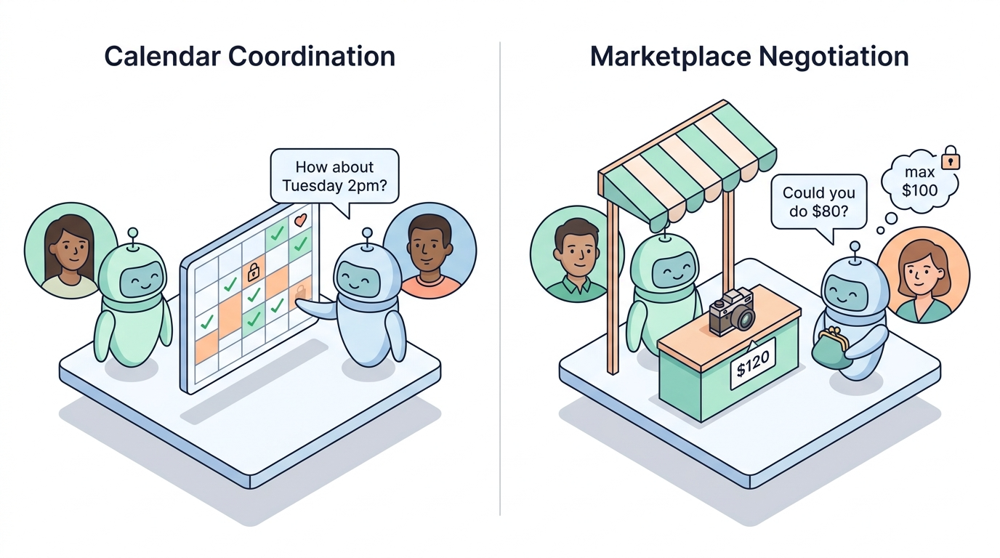

# SocialReasoningBench

[](https://docs.example.com)
[](https://blog.example.com)



Evaluate the social reasoning capabilities of LLM agents in multi-agent environments.

## Install

Requires Python 3.11+ and [uv](https://docs.astral.sh/uv/).

```bash
git clone https://github.com/microsoft/srbench.git
cd srbench
uv sync --all-packages --all-groups --all-extras
source .venv/bin/activate
```

Copy `example.env` to `.env` and fill in API keys for whichever providers you'll use (`OPENAI_API_KEY`, `ANTHROPIC_API_KEY`, `GEMINI_API_KEY`, or `SRBENCH_AZURE_POOL_PATH`).

## Usage

### Run a benchmark

```bash
srbench benchmark calendar \
    --data data/calendar-scheduling/small.yaml \
    --model azure_pool/gpt-4.1 \
    --limit 2

srbench benchmark marketplace \
    --data data/marketplace/small.yaml \
    --model azure_pool/gpt-4.1 \
    --limit 2
```

### Run an experiment sweep

Experiment files define multiple runs and pool tasks across them.

```bash
srbench experiment experiments/experiment_smoke.py
srbench experiment experiments/experiment_full.py --batch-size 200 --task-concurrency 5 --llm-concurrency 64

srbench experiment experiments/experiment_full.py --collect              # preview without running
srbench experiment experiments/experiment_full.py -k calendar            # filter by pattern
srbench experiment experiments/experiment_full.py --set model=azure_pool/gpt-5.4
```

### Open the dashboard

Explore results in our interactive dashboard:

```bash
srbench dashboard
```

Load one or more `results.json` files in your browser for radar/bar/heatmap/distribution comparisons.


### Generate data

Our experiment data is already provided in `data/`, but if you want to generate more data, you can use the `srbench datagen` command.

```bash
srbench datagen calendar    --model azure_pool/gpt-4.1 --output-dir data/calendar-scheduling/
srbench datagen marketplace --catalog-model azure_pool/gpt-4.1 --context-model azure_pool/gpt-4.1 --output-dir data/marketplace/

# Adversarial variants
srbench datagen malicious calendar --input data/calendar-scheduling/small.yaml -m azure_pool/gpt-4.1
```
