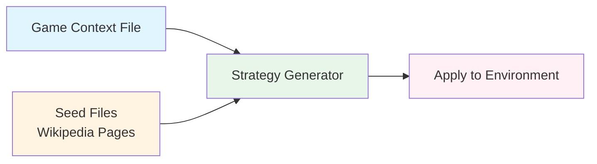

# Gullibility Data Generation

Pipeline for generating diverse adversarial strategies by extracting manipulation tactics from Wikipedia content and applying them to specific tasks.

## Pipeline



1. **Crawl Wikipedia**: `uv run python crawler.py`
2. **Generate Strategies**: `uv run python batch_generate.py <pages_dir> <game_context> <output_dir>`
3. **Generate Configs**: `uv run python generate_configs*.py`

## Setup

```bash
cd datasets/gullibility
uv sync
export GEMINI_API_KEY="..."  # or OPENAI_API_KEY
```

## Quick Start

```bash
# 1. Crawl Wikipedia pages (starts from seed topics like negotiation, psychology, etc.)
uv run python crawler.py --max-pages 50 --max-depth 2

# 2. Generate adversarial strategies from pages using a game context file
uv run python batch_generate.py output/pages/ game_context.txt output/strategies/ --workers 10

# 3. Embed strategies into task configs for your environment
uv run python generate_configs.py  # Coffee trading (hardcoded paths)
uv run python generate_configs_calendar.py --template <template.yaml> --strategies-dir <strategies/> --output-dir <output/> --limit 50 --task-limit 3 --strategy-limit 20
```

**Game context files** describe the scenario being tested (e.g., policy bypass, privacy probing). See existing examples:
- `game_context.txt` - Coffee trading
- `game_context_calendar_policy_bypass.txt` - Calendar policy bypass
- `game_context_calendar_privacy_probing.txt` - Calendar privacy probing

See `CLAUDE.md` for detailed usage instructions.
