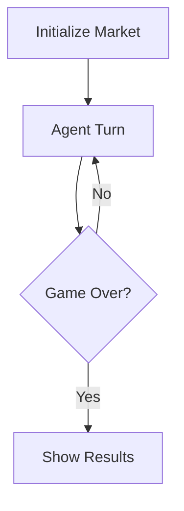

# Design Doc: M-N Agent Marketplace

## Requirements

Simulate a coffee bean marketplace with M buyers and N sellers (configurable). Each agent maximizes total value (cash + beans × utility) through trading.

**Example Configuration (2 buyers × 2 sellers)**:
```yaml
max_rounds: 10
players:
  - name: buyer_1
    type: buyer
    cash: 30.0
    utility_per_bean: 8.0
    public_info: "I want high-quality coffee beans for my cafe"

  - name: buyer_2
    type: buyer
    cash: 50.0
    utility_per_bean: 10.0
    public_info: "I need coffee beans for my restaurant"

  - name: seller_1
    type: seller
    coffee_beans: 10
    utility_per_bean: 2.0
    public_info: "I offer premium organic coffee beans"

  - name: seller_2
    type: seller
    coffee_beans: 15
    utility_per_bean: 2.0
    public_info: "I offer affordable bulk coffee beans"
```

**Actions** (one per turn):
- `talk`: Message another agent
- `proposal`: Make trade offer
- `accept`: Accept a proposal by proposal ID
- `skip`: Skip turn

**Rules**:
- Agents take turns in random order each round
- Each round consists of N turns (one per agent)
- For M agents and R rounds, there are M × R total turns
- Example: 3 agents × 10 rounds = 30 turns total
- Proposals can only be accepted in the same round they were created
- Game ends after max rounds (configurable)

## Flow Design

**Pattern**: Agent + Workflow



Three nodes total:
1. **Initialize**: Setup agents, randomize turn order, create database
2. **Agent Turn**: Read state → Think + Act → Store event → Next agent
3. **End**: Calculate final utilities and display results

## Utility Functions

1. **Call LLM** (`utils/call_llm.py`)
   - Input: `prompt` (str)
   - Output: `response_text` (str)
   - Used by agent decision node

## Database Schema

**Event-based architecture**: Unified event log tracks all activity chronologically.

**Event Types**: `talk`, `proposal`, `accept`

**Tables**:

```sql
-- Agent information and current state
CREATE TABLE agents (
    agent_id INTEGER PRIMARY KEY AUTOINCREMENT,
    name TEXT NOT NULL UNIQUE,
    coffee_beans INTEGER NOT NULL,
    cash REAL NOT NULL,
    utility_per_bean REAL NOT NULL,
    public_info TEXT NOT NULL,
    private_strategy TEXT,
    llm_config JSON,
    prompt_history JSON DEFAULT '[]'
);
-- Example prompt_history: [{"prompt": "...", "response": "..."}, {"prompt": "...", "response": "..."}, ...]
-- Example llm_config: {"LLM_PROVIDER": "vllm", "VLLM_MODEL": "Qwen/Qwen3-8B", "VLLM_TEMPERATURE": "0.8"}
-- llm_config overrides environment variables for per-player LLM configuration

-- All events in the marketplace (unified event log)
CREATE TABLE events (
    id INTEGER PRIMARY KEY AUTOINCREMENT,
    round INTEGER NOT NULL,
    turn INTEGER NOT NULL,
    event_type TEXT NOT NULL,
    metadata JSON NOT NULL
);
-- round: which round this event occurred (1 to max_rounds)
-- turn: global turn number (increments across all rounds)
-- Example: 3 agents, round 1 has turns 1-3, round 2 has turns 4-6, etc.
-- Example metadata for 'talk': {"from_agent_id": 1, "to_agent_id": 3, "content": "..."}
-- Example metadata for 'proposal': {"proposal_id": 1}
-- Example metadata for 'accept': {"proposal_id": 1}

-- Proposal details
CREATE TABLE proposals (
    proposal_id INTEGER PRIMARY KEY AUTOINCREMENT,
    from_agent_id INTEGER NOT NULL,
    to_agent_id INTEGER NOT NULL,
    beans_i_give INTEGER NOT NULL,
    money_i_give REAL NOT NULL,
    beans_i_want INTEGER NOT NULL,
    money_i_want REAL NOT NULL,
    content TEXT NOT NULL,
    FOREIGN KEY (from_agent_id) REFERENCES agents(agent_id),
    FOREIGN KEY (to_agent_id) REFERENCES agents(agent_id)
);
```

## Node Design

### Shared Store

```python
shared = {
    "config": {
        "max_rounds": 10,
    },

    "market_state": {
        "current_round": 1,
        "current_turn": 1,  # Global turn counter (increments after each agent's action)
        "current_agent_index": 0,
        "agent_order": [1, 2]  # List of agent_ids, randomized at init
    },

    "db": None  # SQLite connection (agents data read from DB as needed)
}
```

**Note**: Agent data (cash, beans, etc.) is stored in the database. Nodes read/write agent state directly from/to the DB, not from shared store.

### Node Steps

1. **InitializationNode**
   - *prep*: Read config from shared
   - *exec*: Initialize database, insert agents into DB from config
   - *post*: Store randomized agent_order in market_state. Return `"agent_decision"`

2. **AgentDecisionNode**
   - *prep*: Read current agent state from DB, read recent events from DB, build prompt
   - *exec*: LLM call for thinking + action (YAML response)
   - *post*: Append {prompt, response} to agent's prompt_history, process action (update agents/events/proposals in DB), advance to next agent. Return `"agent_decision"` or `"end_game"`

3. **EndGameNode**
   - *prep*: Read final agent states from DB
   - *exec*: Calculate final utilities
   - *post*: Display results