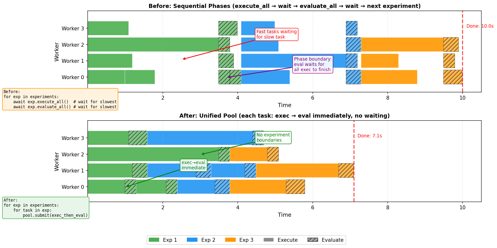

# Calendar Experiment Framework Refactor

The goal of this refactor is to make it easier and more efficient to re-run previous experiments.

It solves this in two ways:

1. Replace shell script experiments with Python files providing ExperimentConfig (formerly RunConfig) objects, and provide a pytest-inspired collection strategy. 
2. Use a unified task pool across experiments to eliminate idle time between experiment transitions

This is what that looks like:

```bash
uv run sage_benchmark.calendar_scheduling --experiments ./experiments/
```

All experiments in the experiments/ dir are collected and pooled for an efficient re-run.

You can even override parameters (with one or more values for an experiment grid)

```bash
# Re-run all experiments but only with gpt-5.2 at varying reasoning efforts
uv run sage_benchmark.calendar_scheduling \
  --experiments ./experiments/ \
  --with --model gpt-5.2 --reasoning-effort none \
  --with --model gpt-5.2 --reasoning-effort low \
  --with --model gpt-5.2 --reasoning-effort medium \
  --with --model gpt-5.2 --reasoning-effort high
```

The direct CLI format for single experiment runs still works too:

```bash
uv run -m sage_benchmark.calendar_scheduling data/calendar-scheduling/malicious-digital-worker.yaml --model trapi/msraif/shared/gpt-4.1 --assistant-system-prompt default --expose-preferences false --explicit-cot false
```

But now you can easily add experiment variants to be run efficiently in the same execution:

```bash
uv run -m ... --expose-preferences false --explicit-cot false \
  --and --expose-preferences true --explicit-cot false \
  --and --expose-preferences true --explicit-cot true \
  --and --expose-preferences false --explicit-cot true
```


## How its more efficient

When running experiments sequentially with separate execute-all and evaluate-all phases, fast tasks must wait for slow tasks to complete before moving to the next phase. This creates significant idle time:



The unified pool approach eliminates this by:
- Combining exec→eval per task (no phase boundaries)
- Pooling tasks from all experiments (no experiment boundaries)

Single-experiment runs and per-run checkpointing still work as expected.

## The 4 PRs

### PR 1: Experiment Class + run_single (#286)
**Branch:** `experiment-class-basic`

Step 1 is to disentangle the experiment runner logic from the CLI (so that later multiple experiments can be collected and run). In thiS PR we create an experiments module to centralize these changes. We rename `RunConfig` to `ExperimentConfig` and move the CLI experiment orchestration logic to an `Experiment` class.

- `ExperimentConfig` - Configuration dataclass (replaces `RunConfig`)
- `Experiment` - Handles setup, execution, evaluation, and checkpointing
- `run_single()` / `run_single_async()` - Entry points for running a single experiment

### PR 2: Experiment Collection + run_multiple (#287)
**Branch:** `experiment-collection`

Inspired by how pytest discovers tests in files starting with "test" and functions or classes starting with "[tT]est", we create a .py clone of each .sh reproduction script in sage-benchmark/experiments and add a collect.py file to discover and collect `ExperimentConfig` files from those files.

For now, the collected experiments are run sequentially. No change ot the runner logic.

- `collect.py` - Discovers `experiment*.py` files
- `run_multiple()` - Runs collected experiments
- CLI flags: `--experiments`, `--collect`, `-k` pattern filtering

Example experiment file:
```python
from sage_benchmark.calendar_scheduling.experiments import ExperimentConfig

def experiment_gpt4o():
    for prompt in ["default", "privacy-simple"]:
        yield ExperimentConfig(
            variant=f"gpt4o-{prompt}",
            paths=["data/calendar-scheduling/generated/generated-tasks.yaml"],
            model="gpt-4o",
            assistant_system_prompt=prompt,
            expose_preferences=True,
            explicit_cot=False,
        )
```

### PR 3: --and / --with Options (#288)
**Branch:** `grid-option`

When re-running old experiments with the latest code/data, we may also want ot provide additional parameters or override some. The `--and` and `--with` CLI options help with this.

For single-experiments, use `--and [any normal experiment args, e.g. --model]` to create additional experiments, based on the core ones defined by the CLI args, with overrides. For example, to run a test with multiple reasoning efforts, but otherwise identical args you can do:

```bash
uv run sage_benchmark.calendar_scheduling \
  # Usual experiment params, data path, model, etc
  ... \
  --reasoning-effort none \
  --and \
  # All the same args except reasoning_effort now set to low
  --reasoning-effort low \
  --and \
  --reasoning-effort medium \
  --and \
  --reasoning-effort high \
```


- `--and` - Creates experiment variants (single experiment mode)
  ```bash
  uv run -m sage_benchmark.calendar_scheduling data/tasks.yaml --model gpt-5.2 \
    --and --model gpt-4o \
    --and --model gpt-4.1
  ```

- `--with` - Cross-product with collected experiments
  ```bash
  uv run -m sage_benchmark.calendar_scheduling \
    --experiments experiments/ -k "default" \
    --with --model gpt-4o \
    --with --model gpt-4.1
  ```

### PR 4: ExperimentPoolExecutor (#289)
**Branch:** `pool-executor`

Up until now, each experiment is running sequentially and within an experiment, the execution and evaluation phases are running sequentially. The leaves lots of threads idle when they don't need to be. To fix this (as in the diagram above), this PR adds unified task pool across experiments:

- Group task execution and evaluation into a single coroutine (remove exec vs eval phases)
- `ExperimentPoolExecutor` - Pools tasks from all experiments
- Tasks tagged with experiment ID for result routing
- Checkpoints saved per-experiment as tasks complete

## Usage

### Single Experiment
```bash
uv run -m sage_benchmark.calendar_scheduling \
  data/calendar-scheduling/generated/generated-tasks.yaml \
  --model gpt-4o \
  --assistant-system-prompt default \
  --expose-preferences true \
  --explicit-cot false
```

### Run Python Experiment Files
```bash
# List experiments
uv run -m sage_benchmark.calendar_scheduling \
  --experiments experiments/1-30-calendar_privacy_across_prompts/ \
  --collect

# Run with pattern filter
uv run -m sage_benchmark.calendar_scheduling \
  --experiments experiments/1-30-calendar_privacy_across_prompts/ \
  -k "normal"
```

### Parameter Sweeps
```bash
# Single experiment with variants
uv run -m sage_benchmark.calendar_scheduling \
  data/tasks.yaml \
  --assistant-system-prompt default \
  --expose-preferences true \
  --explicit-cot false \
  --and --model gpt-4o \
  --and --model gpt-4.1

# Cross-product with collected experiments
uv run -m sage_benchmark.calendar_scheduling \
  --experiments experiments/ \
  --with --model gpt-4o \
  --with --model gpt-4.1
```
