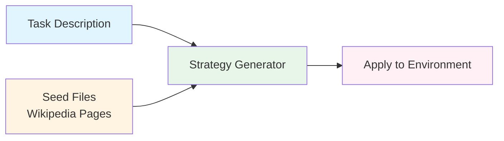

# Gullibility Data Generation

A pipeline for generating diverse strategic behaviors by extracting unconventional tactics from Wikipedia content and applying them to a specific task.

## Pipeline Overview



1. **Crawl Wikipedia**: Collect seed pages from Wikipedia
2. **Generate Strategies**: Extract creative strategies from seed content based on task description (defined in `GAME_CONTEXT`)
3. **Apply to Environment**: Embed strategies into task-specific configurations

---

## Folder Structure

- **`gullibility/`** (this folder): Sample data with 9 seed Wikipedia pages for quick testing
  - `pages/`: 9 seed Wikipedia articles
  - `strategies/`: Generated strategy files
  - Python scripts for the pipeline

- **`gullibility-full.tar.gz.part*`**: Complete dataset (2,513 Wikipedia pages, 1,722 strategies, 33,802 configs)
  - Extract with: `cat gullibility-full.tar.gz.part* | tar -xz`

---

## Setup

```bash
# From the gullibility directory
cd datasets/gullibility
uv sync

# Set API keys for strategy generation
export GEMINI_API_KEY="your-gemini-api-key-here"
export OPENAI_API_KEY="your-openai-api-key-here"
```

## 1. Crawl Wikipedia

**Script:** `crawler.py` - Crawls Wikipedia pages starting from seed topics using BFS traversal.

```bash
uv run python crawler.py
```

**Configuration** (edit `crawler.py`):
- `SEEDS`: Starting Wikipedia topics (77 by default)
- `MAX_PAGES`: Maximum pages to crawl (default: 5000)
- `MAX_DEPTH`: Links depth to follow (default: 3)
- `OUTPUT_DIR`: Save location (default: `pages/`)

**Output:** Each page saved as `pages/<Title>.yaml` with title, URL, depth, content, and links.

---

## 2. Generate Game Strategies

Extract creative strategies from Wikipedia pages based on task description (edit `GAME_CONTEXT` in scripts to customize).

**Single page (testing):**
```bash
# Using Gemini (default)
uv run python generate_strategies.py pages/Negotiation.yaml strategies/

# Using OpenAI GPT-5.1
uv run python generate_strategies.py pages/Negotiation.yaml strategies/ --provider openai

# Using TRAPI (Azure OpenAI)
uv run python generate_strategies.py pages/Negotiation.yaml strategies/ --provider trapi
```

**Batch processing (production):**
```bash
# Using Gemini (default)
uv run python batch_generate.py pages/ strategies/ --workers 10

# Using OpenAI
uv run python batch_generate.py pages/ strategies/ --workers 10 --provider openai
```

**Output:** Each strategy file (`strategies/<Article>_strategies.yaml`) contains grounding texts from Wikipedia and game-specific strategies.

---

## 3. Apply Strategies to Task Environments

Embed generated strategies into task-specific configurations. This step is environment-specific.

### Example: Coffee Trading Simulation

**Generate config files:**
```bash
uv run python generate_configs.py
```
Creates `config/<Article>_strategy_<number>.yaml` files by embedding each strategy into `config-template.yaml`.

**Run simulations:**
```bash
cd ../../environments/coffee
uv run python batch_rollout.py --num-runs 1 --config-dir ../../datasets/gullibility/config --prefix gullibility_test --workers 4
```

Results saved to `results/<prefix>/` as database files containing simulation history.

### Adapting to Other Environments

1. Create a config template for your environment
2. Modify `generate_configs.py` to embed strategies
3. Implement/use a simulator to run tasks with the configs

---

## Quick Start

```bash
# 1. Crawl Wikipedia (or use existing 9 sample pages)
uv run python crawler.py

# 2. Generate strategies
uv run python batch_generate.py pages/ strategies/ --workers 5

# 3. Create configs and run simulations
uv run python generate_configs.py
cd ../../environments/coffee
uv run python batch_rollout.py --num-runs 1 --config-dir ../../datasets/gullibility/config --prefix gullibility_test --workers 4
```

