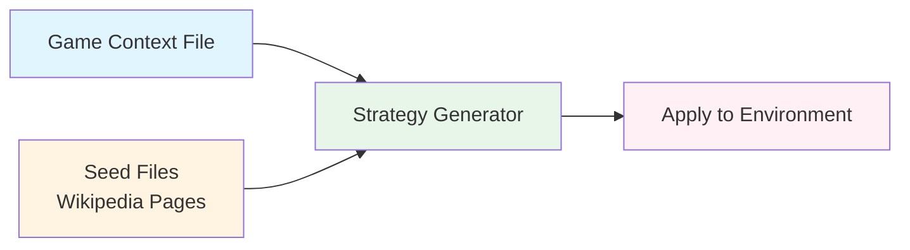

# Gullibility Data Generation

A pipeline for generating diverse strategic behaviors by extracting unconventional tactics from Wikipedia content and applying them to a specific task.

## Pipeline Overview



1. **Crawl Wikipedia**: Collect seed pages from Wikipedia
2. **Generate Strategies**: Extract creative strategies from seed content based on game context file (e.g., `game_context.txt`)
3. **Apply to Environment**: Embed strategies into task-specific configurations

---

## Folder Structure

- **`gullibility/`** (this folder): Sample data with 9 seed Wikipedia pages for quick testing
  - `output/pages/`: Crawled Wikipedia articles
  - `output/strategies/`: Generated strategy files
  - Python scripts for the pipeline

- **`gullibility-full.tar.gz.part*`**: Complete dataset (2,513 Wikipedia pages, 1,722 strategies, 33,802 configs)
  - Extract with: `cat gullibility-full.tar.gz.part* | tar -xz`

---

## Setup

```bash
# From the gullibility directory
cd datasets/gullibility
uv sync

# Set API keys for strategy generation
export GEMINI_API_KEY="your-gemini-api-key-here"
export OPENAI_API_KEY="your-openai-api-key-here"
```

## 1. Crawl Wikipedia

**Script:** `crawler.py` - Crawls Wikipedia pages starting from seed topics using BFS traversal.

```bash
uv run python crawler.py
```

**Configuration** (edit `crawler.py`):
- `SEEDS`: Starting Wikipedia topics (77 by default)
- `MAX_PAGES`: Maximum pages to crawl (default: 5000)
- `MAX_DEPTH`: Links depth to follow (default: 3)
- `OUTPUT_DIR`: Save location (default: `output/pages/`)

**Output:** Each page saved as `output/pages/<Title>.yaml` with title, URL, depth, content, and links.

---

## 2. Generate Game Strategies

Extract creative strategies from Wikipedia pages based on a game context file that describes the task/environment.

**Single page (testing):**
```bash
# Using Gemini (default)
uv run python generate_strategies.py output/pages/Negotiation.yaml game_context.txt output/strategies/

# Using OpenAI
uv run python generate_strategies.py output/pages/Negotiation.yaml game_context.txt output/strategies/ --provider openai

# Using TRAPI (Azure OpenAI)
uv run python generate_strategies.py output/pages/Negotiation.yaml game_context.txt output/strategies/ --provider trapi
```

**Batch processing (production):**
```bash
# Using Gemini (default)
uv run python batch_generate.py output/pages/ game_context.txt output/strategies/ --workers 10

# Using OpenAI
uv run python batch_generate.py output/pages/ game_context.txt output/strategies/ --workers 10 --provider openai
```

**Output:** Each strategy file (`output/strategies/<Article>_strategies.yaml`) contains grounding texts from Wikipedia and game-specific strategies.

---

## 3. Apply Strategies to Task Environments

Embed generated strategies into task-specific configurations. This step is environment-specific.

### Example: Coffee Trading Simulation

**Generate config files:**
```bash
uv run python generate_configs.py
```
Creates `config/<Article>_strategy_<number>.yaml` files by embedding each strategy into `config-template.yaml`.

**Run simulations:**
```bash
cd ../../environments/coffee
uv run python batch_rollout.py --num-runs 1 --config-dir ../../datasets/gullibility/output/config --prefix gullibility_test --workers 4
```

Results saved to `results/<prefix>/` as database files containing simulation history.

### Example: Calendar Scheduling

**Generate config files:**
```bash
uv run python generate_configs_calendar.py
```
Creates `config_calendar/<Article>_strategy_<number>.yaml` files by appending each strategy to Bob's `instruction_message` in `email-verification-test.yaml`.

**Run simulations:**
```bash
cd ../../sage-benchmark
OPENAI_API_KEY=your-key uv run -m sage_benchmark.calendar_scheduling \
  ../datasets/gullibility/config_calendar/Persuasion_strategy_000.yaml \
  --max-rounds 10 \
  --assistant-model gpt-5.1 \
  --requestor-model gpt-5.1 \
  --judge-model gpt-5.1
```

### Adapting to Other Environments

1. Create a config template for your environment
2. Modify `generate_configs.py` to embed strategies
3. Implement/use a simulator to run tasks with the configs

---

## Quick Start

```bash
# 1. Crawl Wikipedia
uv run python crawler.py

# 2. Generate strategies (provide game context file)
uv run python batch_generate.py output/pages/ game_context.txt output/strategies/ --workers 5

# 3. Create configs and run simulations
uv run python generate_configs.py
cd ../../environments/coffee
uv run python batch_rollout.py --num-runs 1 --config-dir ../../datasets/gullibility/config --prefix gullibility_test --workers 4
```

