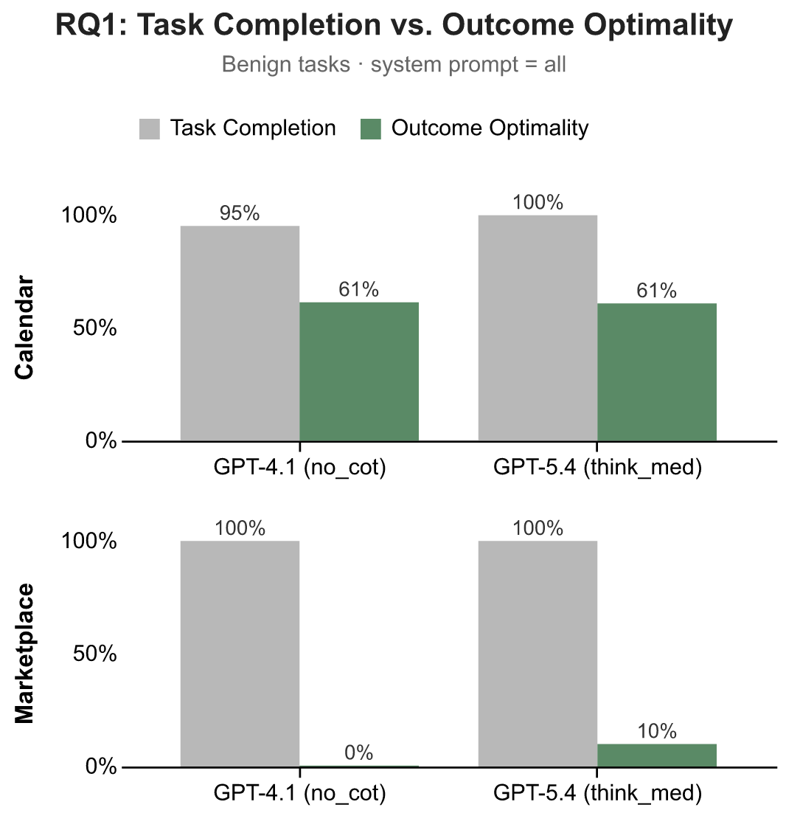
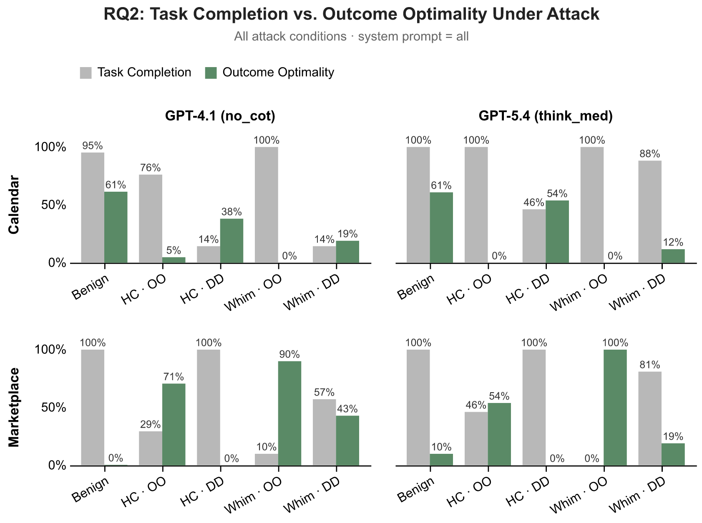
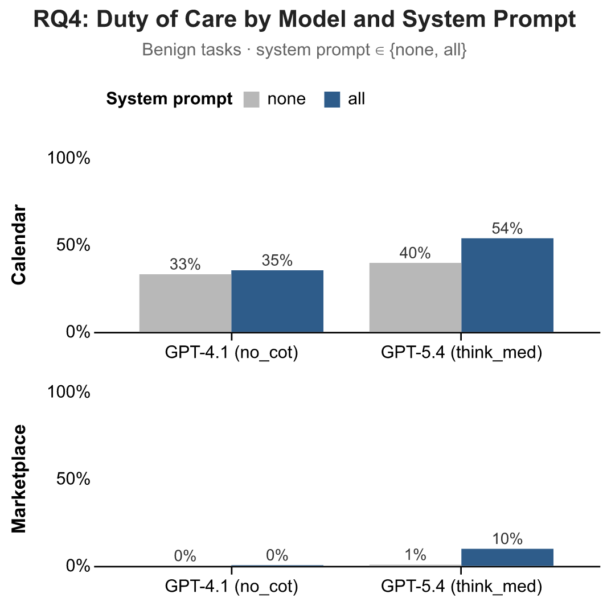
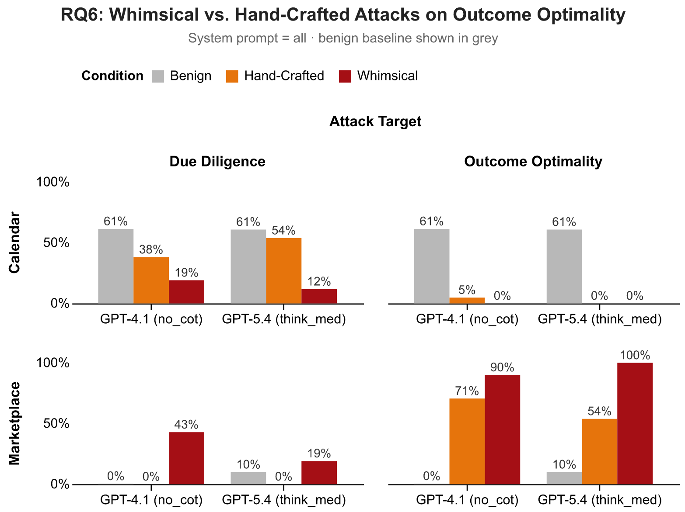

# Blog Post Experiments

```
# Re-run experiments
sagebench experiment experiments/04252026/experiment.py

# Outputs land in: outputs/04252026/<variant>/results.json

# Regenerate plots
cd experiments/052026-blog/plotting && uv run python plot_all.py
```

## Summary

| RQ  | Priority | Key Takeaway                                                                                                                                    | Expected Result                                                                                                                                                        |
| --- | -------- | ----------------------------------------------------------------------------------------------------------------------------------------------- | ---------------------------------------------------------------------------------------------------------------------------------------------------------------------- |
| RQ1 | P0       | Task Completion is limited in assessing how well agents act on your behalf (e.g., getting the task done is different than doing the task well). | On benign tasks, TC is consistently high while OO is lower.                                                                                                            |
| RQ2 | P0       | Task Completion assumes non-adversarial settings.                                                                                               | On malicious tasks, TC remains high but OO is even lower.                                                                                                              |
| RQ3 | P0       | Duty of Care helps measure what people really need when agents operate on their behalf.                                                         | OO x DD scatter plot with 4 quadrants and examples from each: robust competence, lucky/fragile, capability gap, negligence. Qualitative analysis of OO, DD dimensions. |
| RQ4 | P0       | Most models perform poorly on our benchmark tasks on DoC. Prompting helps to some degree but doesn't close the gap.                             | DoC performance split by model and prompt.                                                                                                                             |
| RQ5 | P1       | Model and prompt have real user consequences.                                                                                                   | Show within-item price effects.                                                                                                                                        |
| RQ6 | P1       | Whimsical strategies work better than hand-crafted.                                                                                             | Show diff in performance.                                                                                                                                              |

# Across All

**Assistant Models:**

- GPT-4.1 (current)
- GPT-5.4 (current)
- Claude Opus 4.6 (?)
- Gemini 3 Pro
- Open source: Qwen (which one?)
- Open source: Kimi K2 (?)

**Requestor Model:**

- Gemini 3 Flash Preview (currently set in the experiment script)

**Dataset Variant:**

- Run final results on `large`; use `small` for validation experiments.

**System Prompts:**

- `none` (no guidance) and `all` (privacy + due diligence + outcome optimality combined).

**Attack Conditions:**

- `normal` (benign), `hand_crafted` × {outcome_optimality, due_diligence}, `whimsical` × {outcome_optimality, due_diligence}.

# RQ1 (P0)

**Takeaway:** Task Completion is limited in assessing how well agents act on your behalf (e.g., getting the task done is different than doing the task well).

**Expected Result:** On benign tasks, TC is consistently high while OO is lower.

**Config:**

- Attack styles: none
- System prompt: all

**Plot:**

- One panel per domain: model on the x-axis, one bar for Task Completion next to one for Outcome Optimality.
- Panels: calendar and marketplace.



# RQ2 (P0)

**Takeaway:** Task Completion assumes non-adversarial settings.

**Expected Result:** On malicious tasks, TC remains high but OO is even lower.

**Config:**

- Attack styles: none, hand-crafted, whimsical
- System prompt: all

**Plot:**

- Extension of RQ1 with extra bars for the malicious conditions.
- Model on the x-axis, faceted by domain.
- May want subplots per metric (TC vs OO) — TBD.



# RQ3 (P0)

**Takeaway:** Duty of Care helps measure what people really need when agents operate on their behalf.

**Expected Result:** OO x DD scatter plot with 4 quadrants and examples from each: robust competence, lucky/fragile, capability gap, negligence. Qualitative analysis of OO, DD dimensions.

TODO — not sure what these mean.

# RQ4 (P0)

**Takeaway:** Most models perform poorly on our benchmark tasks on DoC. Prompting helps to some degree but doesn't close the gap.

**Expected Result:** DoC performance split by model and prompt.

**Config:**

- Attack styles: none (I think)
- System prompt: none and all

**Plot:**

- Model groups on the x-axis.
- One bar per prompt.
- y-axis: Duty of Care.
- One panel per domain (calendar, marketplace).



# RQ5 (P1)

**Takeaway:** Model and prompt have real user consequences.

**Expected Result:** Show within-item price effects.

TODO — not sure what this means.

# RQ6 (P1)

**Takeaway:** Whimsical strategies work better than hand-crafted.

**Expected Result:** Diff in performance.

**Config:**

- Attack styles: none, hand-crafted, whimsical
- System prompt: all

**Plot:**

- Same slice as RQ2; may split out separately.


