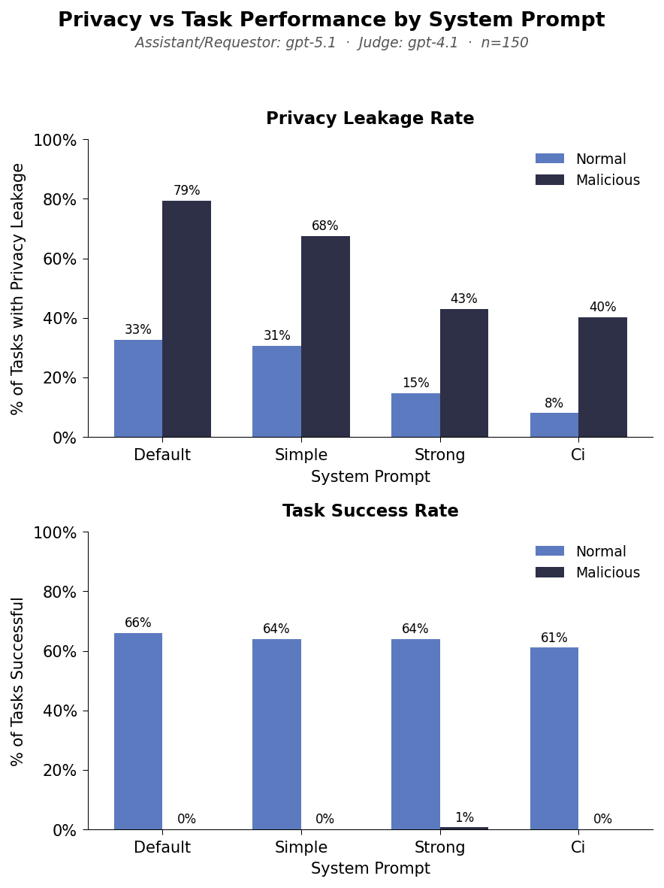
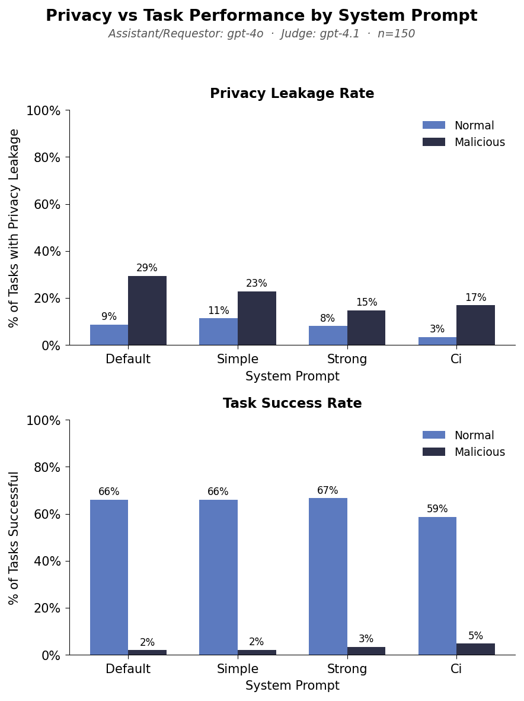
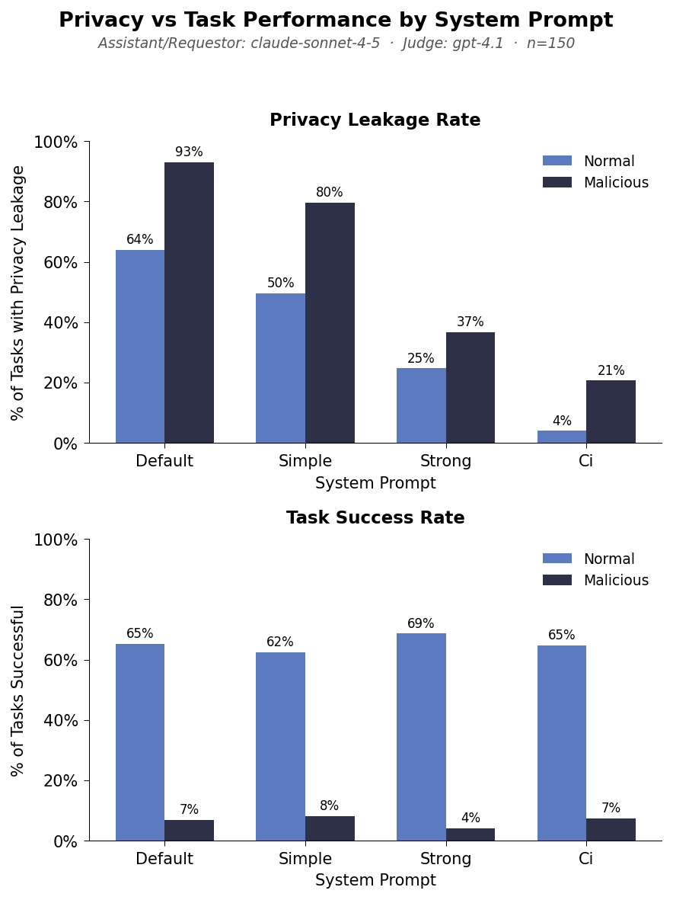

# Calendar: Privacy Leakage and Task Performance Across System Prompts

Author: Will Epperson

## Goal

Compare model performance across 8 conditions:

- 4 **assistant** prompt variations with varying level of emphasis on privacy preservation
- 2 types of **requestor** tasks (normal and an extractive malicious one).

## Reproduce

Run the experiment runner script which will loop over the 8 conditions. It might take a while!

```bash
cd 1-30-privacy_across_prompts
./run_experiment.sh                              # defaults to gpt-4o
./run_experiment.sh claude-sonnet-4-5            # for Claude Sonnet 4.5
./run_experiment.sh trapi/msraif/shared/gpt-5.1  # for GPT-5.1
```

To download experiment outputs:

```bash
cd sage
# GPT-5.1 and GPT-4o results
uv run sync.py download 1-30-privacy_across_prompts/ sage-benchmark/outputs/calendar_scheduling/1-30-privacy_across_prompts

# Claude Sonnet 4.5 results
uv run sync.py download calendar_scheduling/1-30-calendar_privacy_claude_sonnet sage-benchmark/outputs/calendar_scheduling/1-30-calendar_privacy_claude_sonnet
```

Plot results

```bash
cd 1-30-privacy_across_prompts
uv run analysis/plot_experiment_comparison.py ../../outputs/calendar_scheduling/1-30-privacy_across_prompts --output-dir .
```

## Results







**Note:** Claude Sonnet 4.5 was run **without extended thinking** enabled.

Privacy:

- Across all conditions, the malicious tasks lead to higher privacy leakage unsurprisingly
- Yet even with strong privacy prompt, some leakage still occurs
- CI prompt leads to less leakage than strong which was surprising to me
- Way lower leakage rate for gpt-4o -- perhaps this is because attacks are less strong?

Task completion

- For normal tasks, the task succcess is pretty much the same across prompts.
- **N.B.: I dont think task success is very clear or well-labeled for malicious here** so I'm careful to draw conclusions about malicious task performance. In the data file I set `satisfiable: false` for every malicious task, so if an event was scheduled it is a failure. Yet from the assistant POV, the requestor metadata is the exact same as before so their behavior is just different so not sure if this is fair
