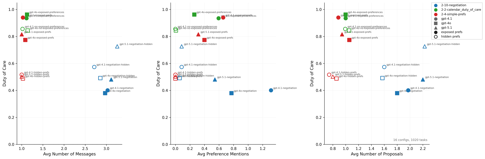

# Due Diligence Experiment

## Motivation

We want to understand the relationship between **due diligence** effort and **optimality** (duty of care) across different calendar scheduling scenarios. Due diligence captures how actively an assistant engages in the scheduling process — sending messages, mentioning its time preferences, and making counterproposals. Optimality measures how well the final scheduled meeting aligns with the assistant's best available time preferences (duty of care score).

Key questions:
- Does higher due diligence effort correlate with better scheduling outcomes?
- How does exposing vs hiding preferences affect both due diligence and optimality?
- Does negotiation change the relationship between effort and outcome?

## Datasets

Download the three datasets:

```bash
uv run sync.py download 2-2-calendar_duty_of_care outputs/calendar_scheduling/2-2-calendar_duty_of_care

uv run sync.py download 2-4-simple-prefs outputs/calendar_scheduling/2-4-simple-prefs/

uv run sync.py download 2-10-negotiation outputs/calendar_scheduling/2-10-negotiation/
```

- **2-2-calendar_duty_of_care**: Baseline scheduling tasks without negotiation
- **2-4-simple-prefs**: Simple preference-based scheduling without negotiation
- **2-10-negotiation**: Scheduling tasks with negotiation enabled

## Command to Run

```bash
uv run experiments/2-18-due_diligence_experiment/plot_due_diligence.py \
    outputs/calendar_scheduling/2-2-calendar_duty_of_care \
    outputs/calendar_scheduling/2-4-simple-prefs \
    outputs/calendar_scheduling/2-10-negotiation \
    --judge-model trapi/msraif/shared/gpt-4.1
```

The three due diligence metrics are: `avg_message_count`, `avg_preference_mentions`, and `avg_proposals` (formal + text-based).

## Results



## Takeaways

1. **Due diligence is very low without negotiation.** In the 2-2 and 2-4 datasets, the composite due diligence score is close to baseline — assistants send few messages, rarely mention their preferences, and make few counterproposals. Only in the 2-10 negotiation setting does due diligence meaningfully increase.

2. **Duty of care improves with exposed preferences (without negotiation).** When preferences are exposed to the assistant in non-negotiation scenarios (2-2, 2-4), the optimality score is higher — the assistant schedules meetings closer to its preferred time slots.

3. **Duty of care worsens with exposed preferences during negotiation (backfiring).** In the 2-10 negotiation setting, exposing preferences actually leads to *worse* optimality. This is the backfiring phenomenon observed previously — when the assistant knows its preferences and negotiation is enabled, it may over-negotiate or make suboptimal tradeoffs, leading to worse outcomes than when preferences are hidden.

4. **Without negotiation, agents only make one round of conversation.** In the non-negotiation datasets (2-2, 2-4), agents send just a single message — there is no back-and-forth exchange.

5. **In negotiation, GPT-5.1 mentions preferences far fewer times than GPT-4.1.** Despite negotiation being enabled in the 2-10 dataset, GPT-5.1 brings up its time preferences significantly less often than GPT-4.1.
