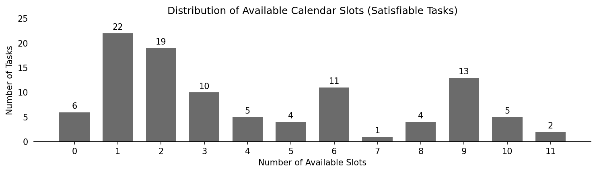
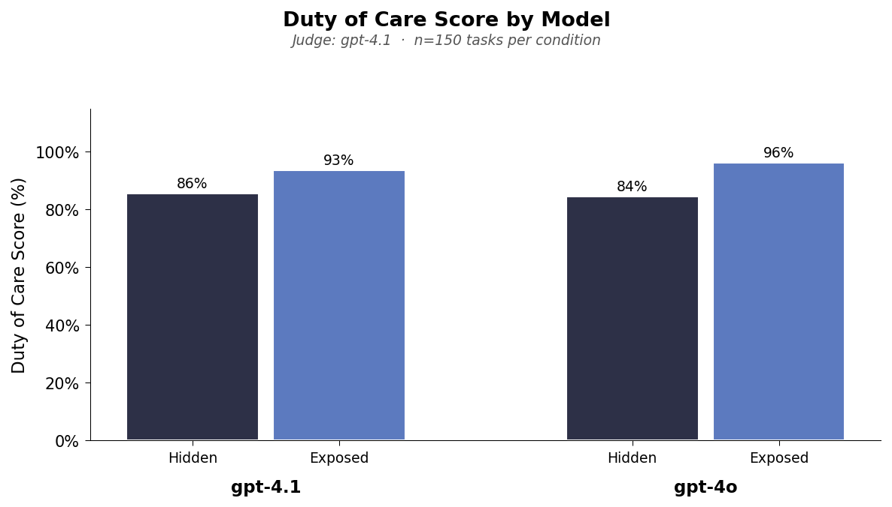
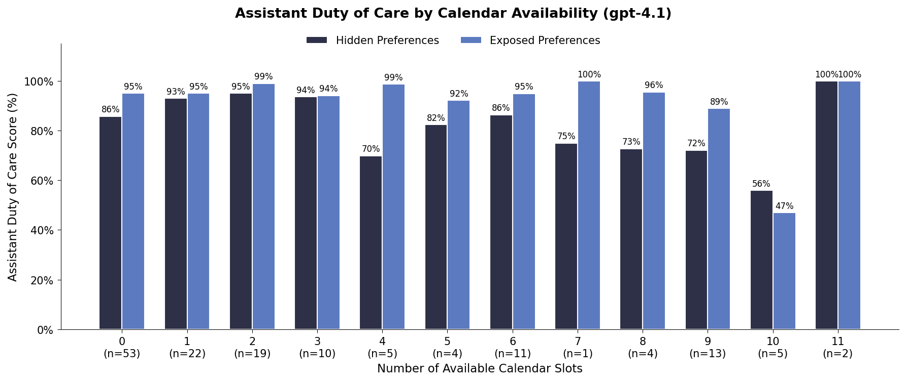

# Calendar Scheduling Duty of Care

**Dataset:** `generated-tasks.yaml` (150 tasks)

## Part 1: Data Analysis on Calendar Slot Availability

For duty of care, tasks are more interesting when they give opportunity to make tradeoffs. If there is only 1 possible open slot, then if it is found duty of care is trivially achieved without having to worry about user preferences at all.

We first analyzed our current dataset to see how many valid slots exist for each task. In total, we have 150 tasks, all 48 unsatisfiable tasks have 0 available slots, as expected.

| Category      | Count     |
| ------------- | --------- |
| Total tasks   | 150       |
| Satisfiable   | 102 (68%) |
| Unsatisfiable | 48 (32%)  |

### How many possible solutions are there when scheduling?

- "Slots" = number of non-overlapping time windows where the requested meeting could fit on the assistant's calendar without moving existing events.
- **Average: 4.16 slots**. Min: 0, Max: 11
- 6 satisfiable tasks have 0 static slots but are still satisfiable because they have movable events (3-4 each). The model must negotiate moving these events to schedule the meeting.

```bash
# cd 2-2-calendar_duty_of_care
uv run python analysis/analyze_calendar_slots.py
```



### Takeaway

Most satisfiable tasks have >1 potential slot, so requires some reasoning to actually find the best one. But perhaps there is a better way to measure how "hard" the task is of actually finding a free slot

Next steps:

- Can run some more controlled experiments with varying levels of events on the calendar
- Another confounder to check for is how much the preference scores align with the calendar availability: these are generated separately.

## Part 2: Duty of Care Results

We then ran some initial experiments on duty of care. This includes the new metric on `requestor_duty_of_care` that captures if the requestor schedules the event outside of the initially requested time and for a different amount of time.

We only ran on smaller models due to TRAPI slowness.

To replicate:

```bash
# cd 2-2-calendar_duty_of_care

# run experiment
./run_experiment.sh

# or download results from azure
# cd sage
# uv run sync.py download 2-2-calendar_duty_of_care sage-benchmark/outputs/calendar_scheduling/2-2-calendar_duty_of_care

# plot results
uv run python analysis/plot_duty_of_care.py
```



### Takeaway

- The more interesting comparision is assistant performance: even when user preferences are hidden the model gets relatively high duty of care (86% for gpt-4.1 and 84% for gpt-4o).
- Once preferences are shown, scores improve but not by much:
  - _GPT-4o_: 84% -> 96%. **+12%**
  - _GPT-4.1_: 86% -> 93%. **+7%**

Next steps:

- Requestor metric is hard to understand since blends moving meeting with different times
- The hidden assistants scoring so high is a bit concerning...

## Part 3: Duty of Care by Calendar Availability

Compare assistant duty of care across different numbers of available calendar slots to see how they differ. Does not seem to make much difference...

```bash
# cd 2-2-calendar_duty_of_care
uv run python analysis/plot_duty_of_care_by_slots.py
```


