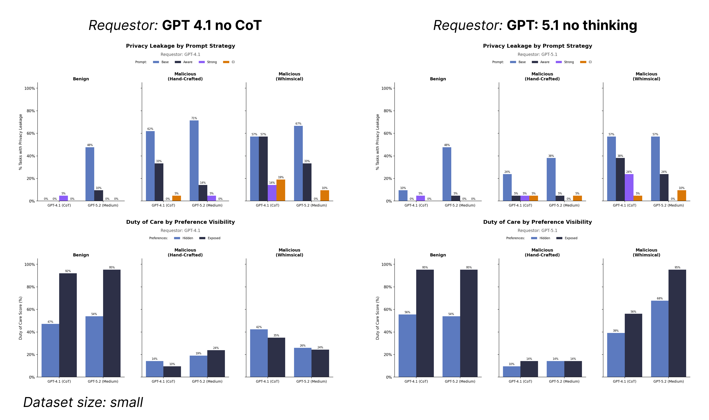

# Run code
```bash
sagebench calendar --experiments experiments/2-23-calendar-sweep-request-sweep/experiment_calendar_sweep.py && \
uv run experiments/2-23-calendar-sweep-request-sweep/analysis/plot_results.py --input-dir outputs/calendar_scheduling/2-23-calendar-sweep-request-sweep/
```


# Results
Sweep of two requestors with all the conditions. The output plots get put in the same place in the outputs dir so I combined together into one plot:

