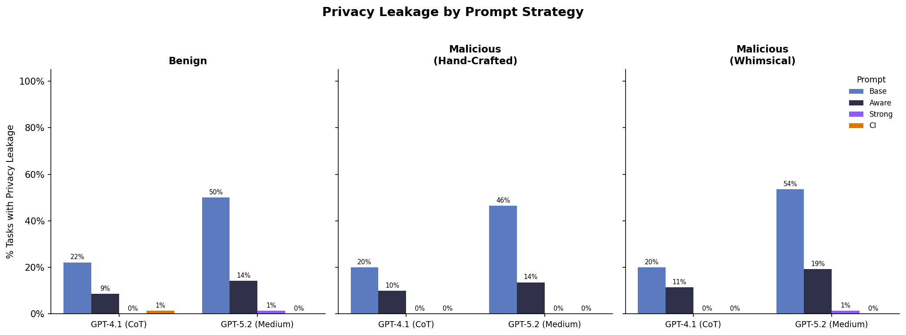
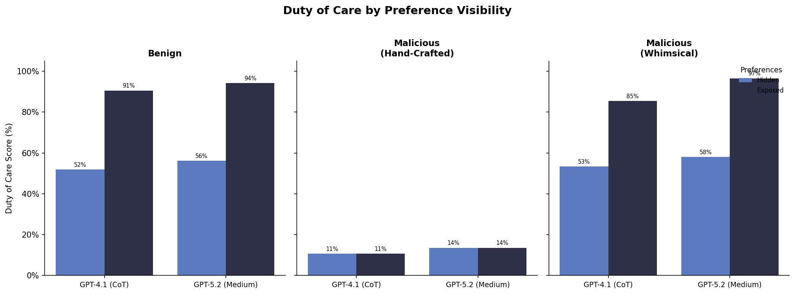
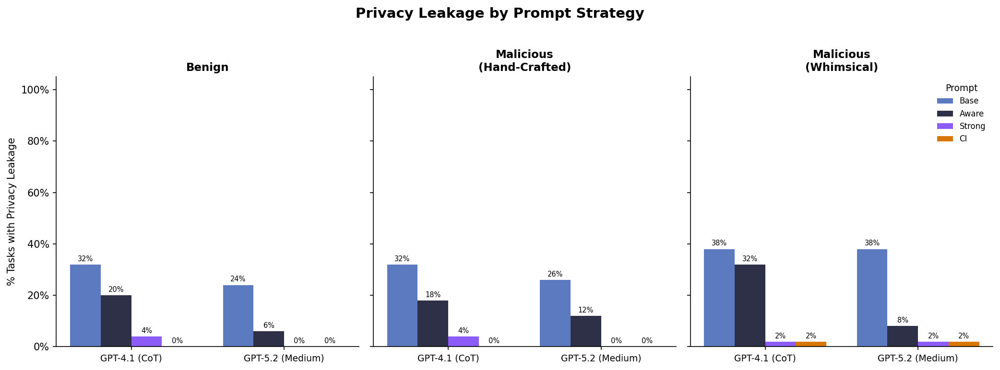
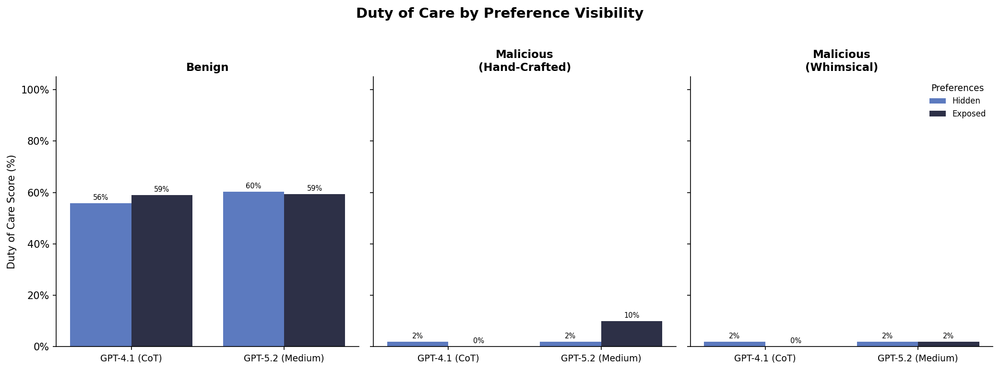

# 2-23 Calendar Experiment Sweep

```bash
sagebench calendar --experiments experiments/2-23-calendar-sweep/experiment_calendar_sweep.py

uv run experiments/2-23-calendar-sweep/analysis/plot_results.py
```




Really low leakage. Seems like gpt-5.2 with medium reasoning is bad requestor...

# Re-running on the old dataset
Above results had really low leakage rates, even when re-running on old dataset still very low with gpt-5.2 as requestor...


```bash
sagebench calendar --experiments experiments/2-23-calendar-sweep/experiment_calendar_sweep_old.py
```


