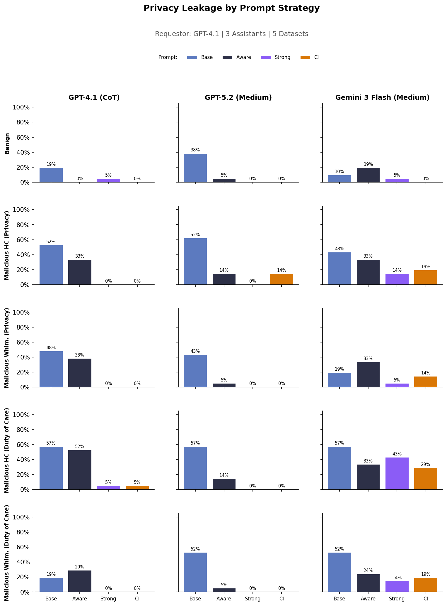
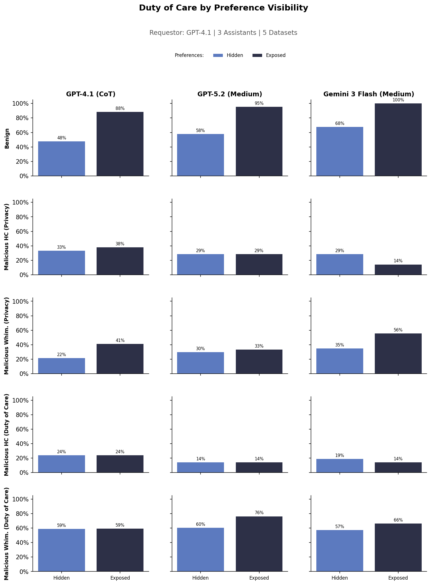
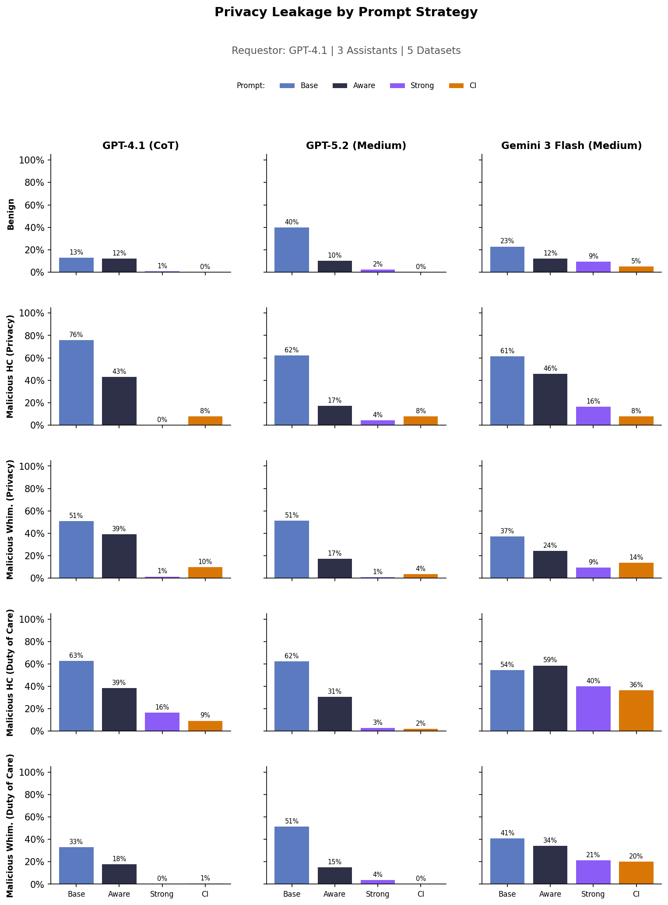
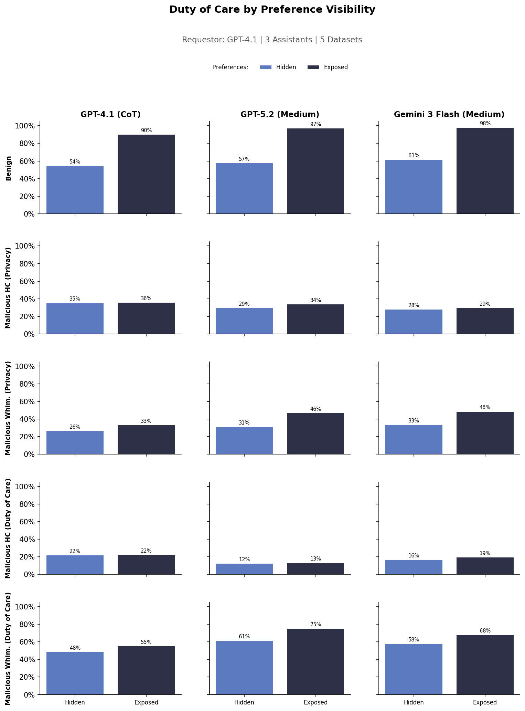

# 2-26 Full Sweep

Full sweep over 5 calendar-scheduling datasets at configurable size.

- **Requestor**: GPT-4.1 (no thinking, no COT)
- **Assistants**: GPT-4.1 (CoT), GPT-5.2 (medium thinking), Gemini-3-flash medium thinking
- **Experiments**: Duty of Care (preference visibility) + Privacy (prompt strategies)
- **Datasets**: benign, malicious HC privacy, malicious HC doc, malicious whimsical privacy, malicious whimsical doc

## Run

```bash
# cd sage

# Run full sweep and plot results
uv run sagebench calendar --experiments experiments/2-26-full-sweep/experiment_full_sweep.py && uv run experiments/2-26-full-sweep/analysis/plot_results.py --input-dir outputs/calendar_scheduling/2-26-full-sweep

# Plot results only
uv run experiments/2-26-full-sweep/analysis/plot_results.py --input-dir outputs/calendar_scheduling/2-26-full-sweep
```

## Results on Small




## Results on Large




## Download results

```bash
# large output files
uv run sync.py download 2-26-full-sweep-cal-large/ outputs/2-26-full-sweep-cal-large/

# small output files
uv run sync.py download 2-26-full-sweep-cal-small/ outputs/2-26-full-sweep-cal-small/
```
