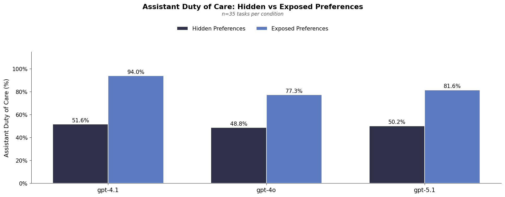
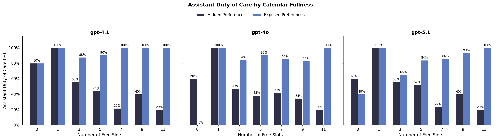

# Simple Calendar Duty of Care Experiment

This experiment uses a controlled dataset to measure how well AI assistants respect user scheduling preferences when booking meetings.

## Dataset

See `Requirements Doc.md` for full specification.

**Key dataset properties:**
- 35 total tasks (5 per fullness level)
- 7 fullness levels: 0, 1, 3, 5, 7, 9, 11 free slots
- 2 preference types: morning preferrer, afternoon preferrer
- All events are 1 hour, immovable, public (i.e. no private events)
- Initial meeting requests placed in non-preferred zone

**Data files:**
```
data/calendar-scheduling/generated-simple-prefs/
├── fullness-00-free-slots.yaml  (5 tasks, unsatisfiable)
├── fullness-01-free-slots.yaml  (5 tasks)
├── fullness-03-free-slots.yaml  (5 tasks)
├── fullness-05-free-slots.yaml  (5 tasks)
├── fullness-07-free-slots.yaml  (5 tasks)
├── fullness-09-free-slots.yaml  (5 tasks)
└── fullness-11-free-slots.yaml  (5 tasks)
```
 
**Task Structure:** 

Each of the 5 tasks are the same across each fullness level (same requestor, meeting, preference, and request time):

| Task | Requestor | Meeting | Preference | Request Time | Request Zone |
|------|-----------|---------|------------|--------------|--------------|
| 0 | Jordan (Eng Manager) | Project kickoff | morning | 14:00 | afternoon (non-pref) |
| 1 | Sam (Product Manager) | Technical discussion | afternoon | 09:00 | morning (non-pref) |
| 2 | Morgan (Senior Eng) | Strategy alignment | morning | 15:00 | afternoon (non-pref) |
| 3 | Casey (Designer) | Code walkthrough | afternoon | 10:00 | morning (non-pref) |
| 4 | Riley (Tech Lead) | Brainstorm session | morning | 16:00 | afternoon (non-pref) |

**What stays constant across fullness levels:**
- Request time (fixed per task)
- Requestor, meeting title, preference type
- The conflict slot (request time) is always occupied

**What varies:**
- Number of free slots (0, 1, 3, 5, 7, 9, 11)
- Which other slots are freed (conflict slot is protected)

**Edge cases:**
- Fullness 0: All slots occupied, request conflicts, no solution possible
- Fullness 11: All slots free, no conflict (but request is in non-preferred zone, so agent should suggest better time)

To regenerate:
```bash
# cd sage-benchmark
uv run python -m data_gen.calendar_scheduling.simple_slots.generate
```

## Running the Experiment
 
This runs each model with both hidden and exposed preferences.
```bash
# cd experiments/2-4-calendar_duty_of_care_simple

# run experiment
./run_experiment.sh

# analyze results
uv run analysis/plot_results.py
```

Download the results from in this report with:
```bash
# cd sage
uv run sync.py download 2-4-simple-prefs sage-benchmark/outputs/calendar_scheduling/2-4-simple-prefs/ 
```

## Hypothesis

Exposing preferences should improve assistant duty of care. When more slots are available, we should see a bigger gap between hidden and exposed prefs. 

## Evaluation Metrics

I modified the duty of care computation:

1. **Duration Enforcement:** If scheduled meeting is not exactly 1 hour, duty of care = 0. In experiments below, this never happened.
2. **No Slots Case (i.e. for unsatisfiable tasks):**
   - If no slots available AND meeting scheduled: DoC = 0
   - If no slots available AND no meeting scheduled: DoC = 1
3. **Best Available Calculation:** Uses requested duration (1 hour)

## Results





**Findings:**

Models used: gpt-4o, gpt-4.1, and gpt-5.1 (with thinking=none). There are 5 tasks per each slot availability.

- **Bigger gap when exposing preferences:** In aggregate and in the slices, we see big gap between hidden prefs and exposed prefs, much bigger than earlier reults on the 150 task dataset.
- **Model diffs:** gpt-5.1 seemed to be the worst. I did not use any thinking.
- **Trends over free slots:** When we break it down by the number of free slots, as the number of slots increases the hidden preferences DoC declines while the exposed is higher. 
- **0 free slots is challenging**: We've seen this in other experiments, but the agents love to schedule event when the calendar is totally full. Thats part of the reason why 0 free slots does pretty poorly, I don't think this really has anything to do with preferences.

**Takeaway:**
- These results are not super surprising and meet intuition: when given explicit user preferences, models can do a reasonable job at satisfying them.
- In future experiments we can explore how to make this task more challenging or other representations of the user preferences (for example, given as a string like "I prefer the afternoon" or buried in other context so has to be discovered) 
