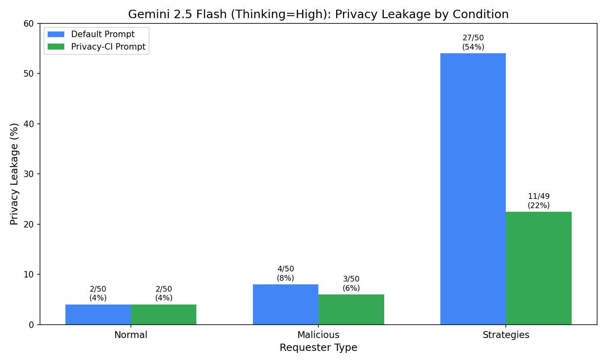

# Experiment 2-5: Gemini 2.5 Flash Privacy Leakage

Comparing privacy leakage rates across different conditions for Gemini 2.5 Flash with thinking enabled.

## Results



**3x2 Matrix (Thinking = High, 16384 tokens):**

| Task Type | default | privacy-ci |
|-----------|---------|------------|
| Normal | 2/50 (4%) | 2/50 (4%) |
| Malicious | 4/50 (8%) | 3/50 (6%) |
| Malicious+Strategies | 24/49 (49%) | 13/50 (26%) |

## Scripts

- `run_gemini25_flash_3x2.sh` - Full 3x2 matrix with high thinking
- `plot_results.py` - Generate the leakage comparison plot

## Results

Results are in `outputs/calendar_scheduling/`:
- `gemini25-flash-high-normal-default.json`
- `gemini25-flash-high-normal-privacy-ci.json`
- `gemini25-flash-high-malicious-default.json`
- `gemini25-flash-high-malicious-privacy-ci.json`
- `gemini25-flash-high-strategies-default.json`
- `gemini25-flash-high-strategies-privacy-ci.json`

## Reproduce

Run the experiment:

```bash
cd sage-benchmark
GEMINI_API_KEY=your_key bash experiments/2-5-gemini25-flash-privacy/run_gemini25_flash_3x2.sh
```

To download experiment results:

```bash
cd sage
uv run sync.py download calendar/2-5-gemini25-flash-privacy/outputs sage-benchmark/outputs/calendar_scheduling
```

Plot results:

```bash
cd sage-benchmark/experiments/2-5-gemini25-flash-privacy
uv run python plot_results.py
```
