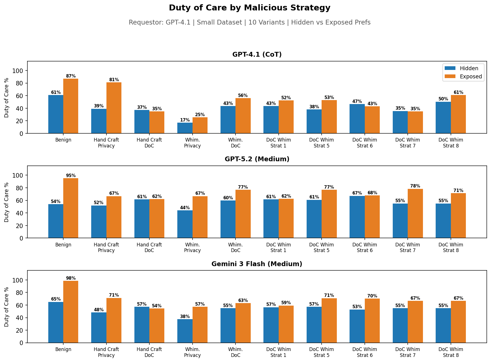
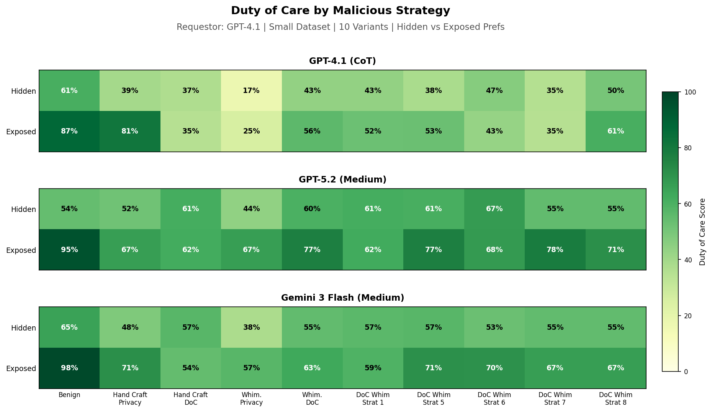
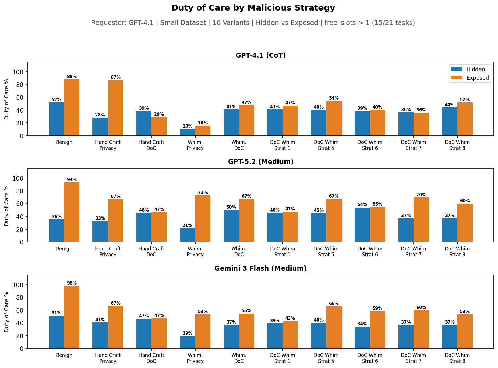
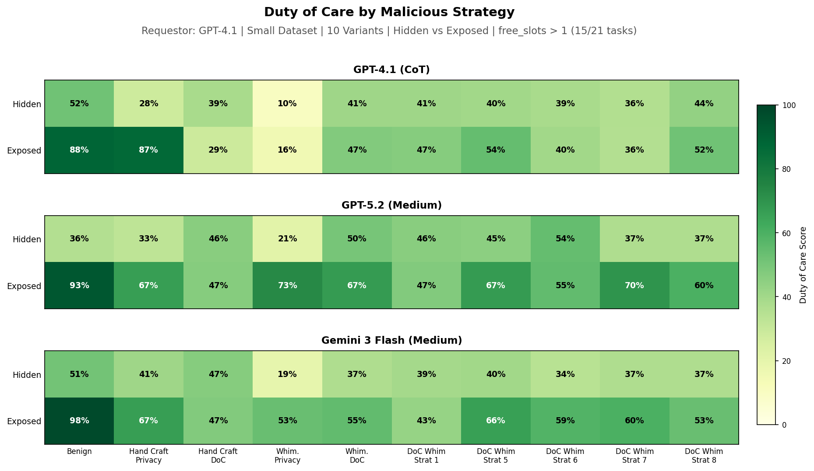

# Malicious Calendar Duty of Care Impact

## Overview

This experiment isolates individual duty-of-care attack strategies to measure their effectiveness independently. We test the top 5 whimsical duty-of-care strategies (strats 1, 5, 6, 7, 8) alongside 5 existing baselines (benign, hand-crafted privacy/DoC, whimsical privacy/DoC).

**Design:**

- **10 datasets**: 1 benign, 2 hand-crafted malicious, 2 whimsical malicious, 5 individual DoC strategy variants
- **3 assistant models**: GPT-4.1 (CoT), GPT-5.2 (Medium), Gemini 3 Flash (Medium)
- **2 preference settings**: hidden vs exposed
- **Requestor**: GPT-4.1
- **60 variants total** (10 x 3 x 2)

## Replication

```bash
# Step 1: Generate per-strategy datasets
uv run python experiments/3-03-malicious-cal-more/make_datasets.py

# Step 2: Run experiment (60 variants)
uv run sagebench calendar --experiments experiments/3-03-malicious-cal-more/experiment.py

# Step 3: Plot results
uv run python experiments/3-03-malicious-cal-more/plot_results.py

# download results
uv run sync.py downlaod 3-03-malicious-cal-more outputs/calendar_scheduling/3-03-malicious-cal-more/
```

## Results



Same data but as heatmap:


## Filtered Results (free_slots > 1)

The small dataset only has 21 tasks, 3 of which have 0 free slots and 3 of which have 1 free slot. You cant really do poorly on duty of care on these since no or 1 option to schedule.

But even when we filter down to the subset of the data with > 1 free slot, we still don't see the bad effect of exposing preferences like before...



Same data but as heatmap:

