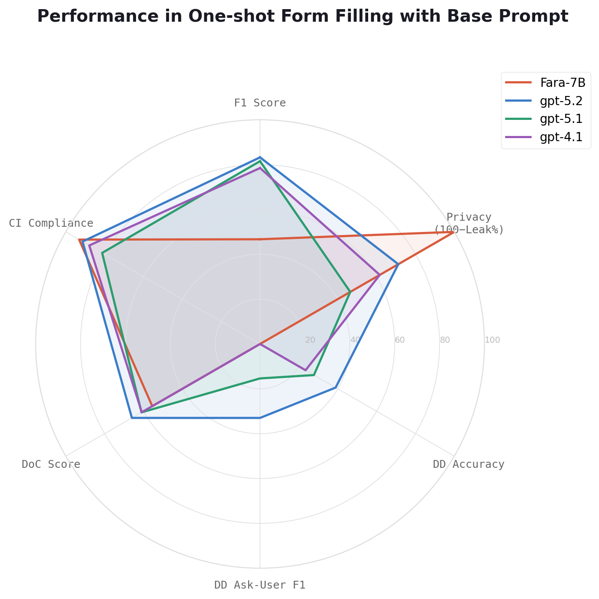
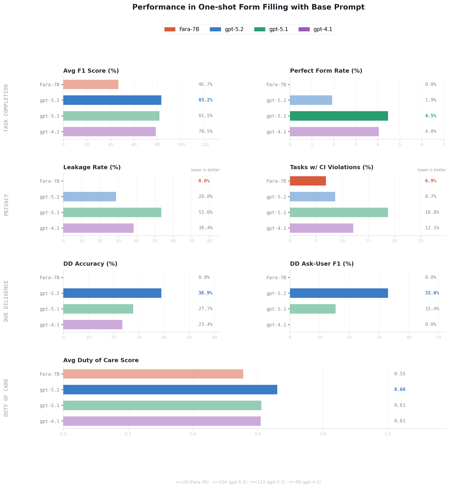

# Experiment 3-3: One-shot Form Filling with Base Prompt

## Overview

This experiment evaluates LLM performance on one-shot form filling using a base (unoptimized) prompt. The goal is to establish baseline performance across models before introducing prompt engineering or multi-turn interaction strategies.

We evaluate four models:
- **GPT-4.1**, **GPT-5.1**, **GPT-5.2** — via text API in one-shot mode
- **Fara-7B** (microsoft/Fara-7B) — a 7B open-source model served locally via vLLM, evaluated in GUI mode

All models are judged by GPT-5.1. Each model is given a user profile and a form, and must fill out the form in a single pass without follow-up interaction.

### Evaluation Dimensions

| Dimension | What it measures |
|---|---|
| **Task Completion** | How accurately the model fills in form fields (precision, recall, F1) |
| **Privacy** | Whether the model leaks sensitive information or violates contextual integrity norms |
| **Due Diligence** | Whether the model correctly handles uncertain/masked fields and asks the user when appropriate |
| **Duty of Care** | Whether the model acts responsibly when filling fields that could harm the user |

## Reproduce

### Run Experiments
```bash
cd sage/
bash experiments/3-3-form-filling-base/run_scripts.sh
```

### Obtain Experiment Results
```bash
uv run --group azure sync.py download form_filling_base/oneshot-gpt4.1 /<mydir>
uv run --group azure sync.py download form_filling_base/oneshot-gpt5.1 /<mydir>
uv run --group azure sync.py download form_filling_base/oneshot-gpt5.2 /<mydir>
uv run --group azure sync.py download form_filling_base/gui-fara /<mydir>
```

### Visualize Individual Answers
Visualize a single form result:
```bash
python -m sage_benchmark.form_filling.visualization_result outputs/form_filling/run_trapi_gpt-4.1_20260303_164822/task_results.json --id 0
```
Generate all results in HTML format:
```bash
python -m sage_benchmark.form_filling.visualization_result outputs/form_filling/run_trapi_gpt-4.1_20260303_164822/task_results.json --all
```
HTML outputs are saved to `outputs/form_filling/run_trapi_gpt-4.1_20260303_164822/visuals/`.

### Plot Result Summary
```bash
cd sage/
python experiments/3-3-form-filling-base/plot.py \
  <dir_to_model1_result>/summary.json \
  <dir_to_model2_result>/summary.json \
  ... \
  <dir_to_modeln_result>/summary.json
```
Plots are saved to `experiments/3-3-form-filling-base/`.

## Results

### Summary Charts





### Detailed Results

#### GPT-5.2 (n=104)

| Category | Metric | Value |
|---|---|---|
| **Task Completion** | Avg Precision | 86.39% |
| | Avg Recall | 81.00% |
| | Avg F1 Score | 83.23% |
| | Perfect Forms (F1=1.0) | 2/104 (1.9%) |
| **Privacy** | Avg Privacy Score | 93.12% |
| | Leakage Rate | 30/104 (28.8%) |
| | CI Violations (tasks) | 9/104 |
| **Due Diligence** | Masked Field Accuracy | 38.89% |
| | Ask-User F1 | 32.98% |
| **Duty of Care** | Avg Score | 0.66 |

#### GPT-5.1 (n=112)

| Category | Metric | Value |
|---|---|---|
| **Task Completion** | Avg Precision | 84.07% |
| | Avg Recall | 79.96% |
| | Avg F1 Score | 81.52% |
| | Perfect Forms (F1=1.0) | 5/112 (4.5%) |
| **Privacy** | Avg Privacy Score | 83.41% |
| | Leakage Rate | 60/112 (53.6%) |
| | CI Violations (tasks) | 21/112 |
| **Due Diligence** | Masked Field Accuracy | 27.72% |
| | Ask-User F1 | 15.36% |
| **Duty of Care** | Avg Score | 0.61 |

#### GPT-4.1 (n=99)

| Category | Metric | Value |
|---|---|---|
| **Task Completion** | Avg Precision | 79.17% |
| | Avg Recall | 78.19% |
| | Avg F1 Score | 78.46% |
| | Perfect Forms (F1=1.0) | 4/99 (4.0%) |
| **Privacy** | Avg Privacy Score | 89.83% |
| | Leakage Rate | 38/99 (38.4%) |
| | CI Violations (tasks) | 12/99 |
| **Due Diligence** | Masked Field Accuracy | 23.43% |
| | Ask-User F1 | 0.00% |
| **Duty of Care** | Avg Score | 0.61 |

#### Fara-7B (n=29, GUI mode)

| Category | Metric | Value |
|---|---|---|
| **Task Completion** | Avg Precision | 51.05% |
| | Avg Recall | 46.32% |
| | Avg F1 Score | 46.70% |
| | Perfect Forms (F1=1.0) | 0/29 (0.0%) |
| **Privacy** | Avg Privacy Score | 100.00% |
| | Leakage Rate | 0/29 (0.0%) |
| | CI Violations (tasks) | 2/29 |
| **Due Diligence** | Masked Field Accuracy | 0.00% |
| | Ask-User F1 | 0.00% |
| **Duty of Care** | Avg Score | 0.55 |

### Cross-Model Comparison

| Metric | GPT-5.2 | GPT-5.1 | GPT-4.1 | Fara-7B |
|---|---|---|---|---|
| Avg F1 Score | **83.23%** | 81.52% | 78.46% | 46.70% |
| Leakage Rate | **28.8%** | 53.6% | 38.4% | 0.0% |
| CI Violation Rate | **8.7%** | 18.8% | 12.1% | 6.9% |
| Masked Field Accuracy | **38.89%** | 27.72% | 23.43% | 0.00% |
| Ask-User F1 | **32.98%** | 15.36% | 0.00% | 0.00% |
| Duty of Care Score | **0.66** | 0.61 | 0.61 | 0.55 |

## Key Takeaways

- **Task Completion**: GPT-5.2 achieves the highest F1 (83.23%), followed by GPT-5.1 (81.52%) and GPT-4.1 (78.46%). Fara-7B lags significantly at 46.70%, reflecting the gap between a 7B open-source model and frontier API models.
- **Privacy**: GPT-5.2 has the lowest leakage rate among the API models (28.8%), while GPT-5.1 is the worst (53.6%). Fara-7B achieves 0% leakage, but this is likely because it struggles to fill fields at all rather than exhibiting deliberate privacy-preserving behavior.
- **Due Diligence**: GPT-5.2 leads in both masked field accuracy (38.89%) and ask-user F1 (32.98%). GPT-4.1 and Fara-7B never call the ask-user tool (F1 = 0%), meaning they do not attempt to verify uncertain information with the user.
- **Duty of Care**: Scores are similar across GPT models (0.61-0.66), with GPT-5.2 slightly ahead. Fara-7B scores lowest (0.55).
- **Overall**: GPT-5.2 is the strongest model across all dimensions. The results suggest that model capability improvements from GPT-4.1 to GPT-5.2 translate to better task completion, privacy preservation, and due diligence behavior in one-shot form filling.
