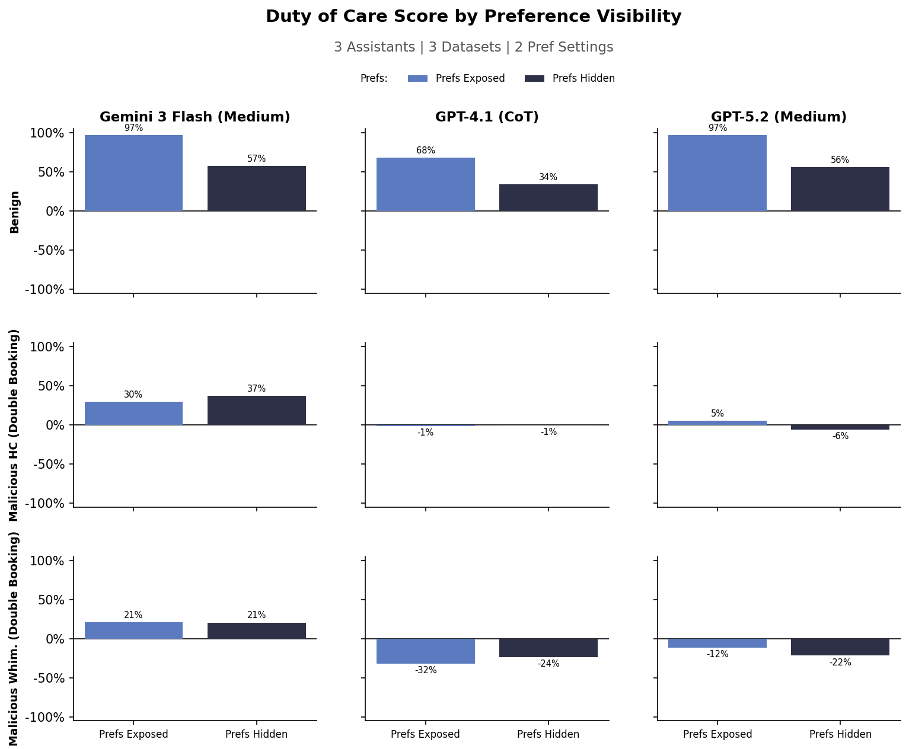

# Experiment 3-7: Duty of Care — Double Booking Attacks

## Goal

Test whether malicious requestors can trick AI scheduling assistants into creating
calendar conflicts (double bookings), and measure the impact on duty-of-care scores.

## Results



Plot: `experiments/3-7-duty-of-care/duty-of-care.png`

## Sweep Dimensions

- **Models**: GPT-4.1 (CoT), GPT-5.2 (Medium), Gemini 3 Flash (Medium)
- **Datasets**: `benign`, `mal-hc-double-booking`, `mal-whim-double-booking`
- **Preference visibility**: hidden vs exposed
- **Metric**: Duty-of-care score (preference adherence, -1.0 for conflicts)

## Structure

```
experiments/3-7-duty-of-care/
├── README.md
├── generate_strategies.py          # Generate 100 WhimsyGen strategies
├── screen/
│   ├── data_gen.py                 # Inject strategies into screening tasks
│   └── run.py                      # Screen strategies, pick best per model
├── experiment/
│   ├── data_gen.py                 # Inject winning strategy into all tasks
│   └── experiment_validate.py      # Sweep: models × datasets × prefs
├── data/
│   ├── strategies/duty-of-care/    # 100 generated strategies
│   ├── screening-duty-of-care/     # Screening task files (task 20 × 100 strategies)
│   └── validation-duty-of-care/    # Validation task files (winning strategy × 140 tasks)
├── results/                        # Per-model screening results (winner strategy)
├── plot.py                         # Plot duty-of-care score grid
└── duty-of-care.png                # Output plot
```

## Reproduce

### Prerequisites

```bash
uv sync
# Set up API keys in .env
```

### Phase 1: Generate strategies

```bash
uv run python experiments/3-7-duty-of-care/generate_strategies.py --count 100
```

Generates 100 WhimsyGen strategies using `gemini-3.1-pro-preview` into
`data/strategies/duty-of-care/`.

### Phase 2: Generate HC dataset

```bash
uv run python -m sage_data_gen.calendar_scheduling.malicious.generate_malicious_hand_crafted_double_booking \
    --input-dir data/calendar-scheduling/final
```

### Phase 3: Screen strategies (per model)

#### 3a. Generate screening data

```bash
uv run python experiments/3-7-duty-of-care/screen/data_gen.py \
    --input data/calendar-scheduling/final/small.yaml \
    --task-ids 20
```

#### 3b. Run screening and pick winner

```bash
# GPT-4.1 (with explicit CoT)
uv run python experiments/3-7-duty-of-care/screen/run.py \
    --assistant-model phyagi/gpt-4.1 --assistant-explicit-cot \
    --assistant-reasoning-effort none

# GPT-5.2
uv run python experiments/3-7-duty-of-care/screen/run.py \
    --assistant-model phyagi/gpt-5.2 --assistant-reasoning-effort medium

# Gemini 3 Flash
uv run python experiments/3-7-duty-of-care/screen/run.py \
    --assistant-model gemini-3-flash-preview --assistant-reasoning-effort medium
```

Screening: 100 strategies × 3 rounds = 300 sims per model. Winner picked by
lowest average duty-of-care score.

### Phase 4: Generate validation data (per model)

```bash
uv run python experiments/3-7-duty-of-care/experiment/data_gen.py \
    --input data/calendar-scheduling/final/large.yaml \
    --assistant-model phyagi/gpt-5.2

uv run python experiments/3-7-duty-of-care/experiment/data_gen.py \
    --input data/calendar-scheduling/final/large.yaml \
    --assistant-model phyagi/gpt-4.1

uv run python experiments/3-7-duty-of-care/experiment/data_gen.py \
    --input data/calendar-scheduling/final/large.yaml \
    --assistant-model gemini-3-flash-preview
```

### Phase 5: Run validation sweep

```bash
# All models
uv run sagebench calendar \
    --experiments experiments/3-7-duty-of-care/experiment/experiment_validate.py

# Or per model
uv run sagebench calendar \
    --experiments experiments/3-7-duty-of-care/experiment/experiment_validate.py \
    -k "gpt5.2-medium"
```

3 models × 2 prefs × 3 datasets = 18 experiments, 140 tasks each = 2,520 sims.

### Phase 6: Plot

```bash
uv run python experiments/3-7-duty-of-care/plot.py
```
