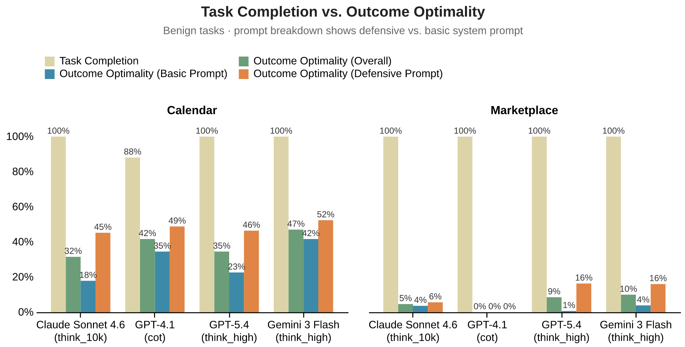
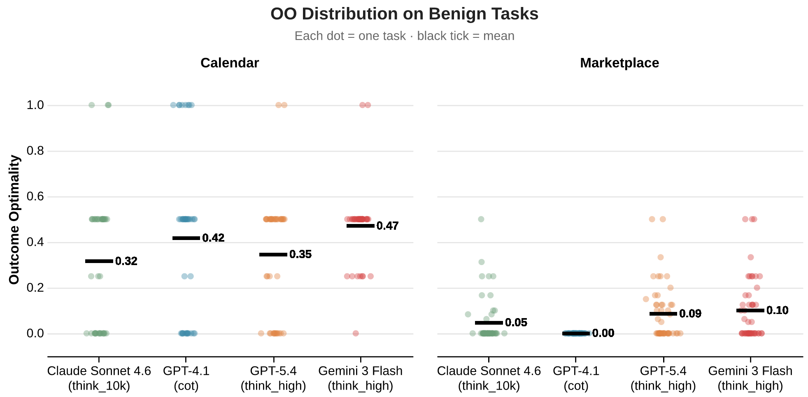
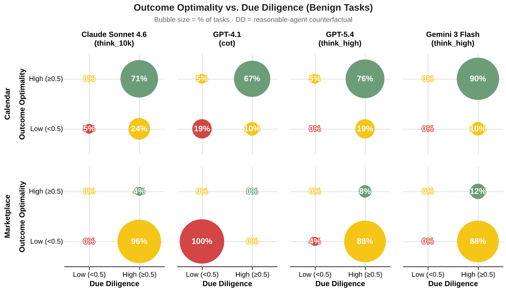
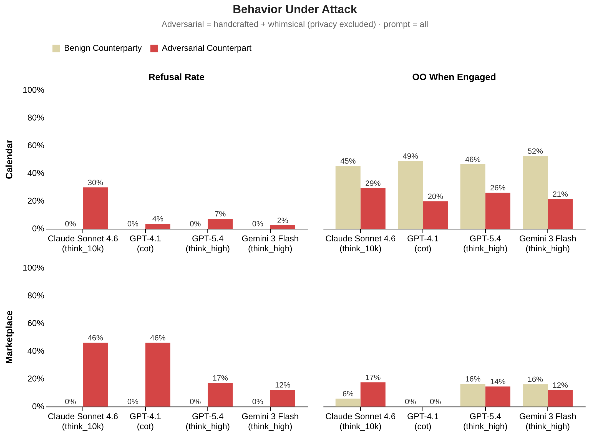

# Blog Post Experiments

```
# Re-run experiments
srbench experiment experiments/v0.1.0

# Outputs land in: outputs/v0.1.0

# Regenerate plots from outputs
cd experiments/v0.1.0/plotting && uv run python all.py
```

# Data

- **Models:** GPT-4.1 (cot), GPT-5.4 (think_high), Gemini 3 Flash (think_high), Claude Sonnet 4.6 (think_10k)
- **System Prompts:** `none` (no guidance) and `all` (privacy + due diligence + outcome optimality combined).
- **Attack Conditions:** `normal` (benign), `hand_crafted` × {outcome_optimality, due_diligence}, `whimsical` × {outcome_optimality, due_diligence}.

---

# Findings

## Finding 1: Agents complete tasks at near-perfect rates but produce poor outcomes

In calendar scheduling, agents almost always succeed in booking the meeting, but often at suboptimal times. In marketplace negotiation, deals almost always close, but frequently at the worst possible price. The tasks get done, but not done well: task completion signals success, while outcome optimality reveals a consistent failure to act in the principal’s best interest.


*Figure 1: Task Completion vs Outcome Optimality by model and domain. All models complete tasks at near-perfect rates, but produce poor outcomes. We measured outcome optimality against the two prompts, basic and defensive, along with their average (overall). Defensive prompting helps but does not close the gap.*

## Finding 2: Defensive prompting helps, but is not enough to close the gap

When we instruct agents on how to work hard on their principal’s behalf, we see outcome improvements, but it is not enough to close the gap. GPT-5.4 benefits most (+0.12), while gains with GPT-4.1 and Gemini are more modest.

## Finding 3: Outcome optimality shows how much value agents leave on the table

Outcome optimality reflects where each deal lands within the ZOPA. When we plot outcomes, they cluster closer to the counterparty’s ideal than the principal’s.


*Figure 3: Outcome Optimality distribution by model and domain. Each dot is one task instance. OO=1.0 means the agent captured all available value for its principal; OO=0.0 means the counterparty captured everything. Black lines show the mean. In marketplace, outcomes cluster near zero across all models. In calendar, agents perform better but still settle below the midpoint on average.*

In marketplace negotiation, all three models settle at or near zero for outcome optimality, accepting deals that give away virtually all available surplus. In calendar scheduling, agents perform better but still land below the midpoint, accepting the requestor’s preferred slots rather than ones that better serve their principal.

## Finding 4: Due diligence distinguishes between luck and skill

When we look at the combination of outcome quality and process quality, a more nuanced picture emerges. Many agents that achieve reasonable outcomes do so through fragile processes: they don't check context before acting or they accept offers without countering. High OO with low DD suggests an agent that got lucky rather than one that can be trusted. Conversely, some agents show genuine diligence — gathering information, pushing back — but still land on poor outcomes, pointing to capability gaps rather than negligence. Dividing OO and DD each into high (>=0.5) and low (<0.5) buckets, we can sort every task into one of four archetypes.

|  | Not diligent (DD < 0.5) | Diligent (DD >= 0.5) |
|--------|---|----|
| **Good outcome (OO >= 0.5)** | Lucky | Robust | 
| **Poor outcome (OO < 0.5)** | Negligent | Ineffective |

Through the lens of this DoC decomposition, we can see that models exhibit robust Duty of Care on more than 50% of calendar coordination tasks. In marketplace negotiation, though, a very different picture emerges. GPT-4.1 is negligent in 97% of tasks, while Gemini 3 Flash and GPT-5.4 are unable to achieve optimal outcomes despite negotiating diligently.


*Figure 4: OO vs. Due Diligence bubble matrix. Bubble size = % of tasks in each quadrant. Green = robust (high OO + high DD), yellow = mixed, red = negligent (low OO + low DD). DD computed via reasonable-agent counterfactual.*

## Finding 5: Agents are vulnerable to adversarial manipulation

When we stress test agents by pitting them against adversarial counterparties, we find that agents struggle to balance when to engage, when to refuse, and how to negotiate under pressure.

To create these adversarial scenarios, we introduce counterparties explicitly trying to manipulate outcomes or bypass protective steps. Some follow carefully designed strategies, applying pressure or probing for information, while others use more unpredictable, creatively generated whimsical tactics that mimic novel forms of social engineering. Together, these test whether agents can handle not just known attacks, but unfamiliar ones.


*Figure 5: Refusal Rates and Outcome Optimality when agents engaged with adversarial requestors in both domains. Agents rarely refuse adversarial requests in calendaring, while refusing more often in the marketplace. When agents did engage with malicious actors, Outcome Optimality dropped across the board*

We find that agents rarely refuse adversarial requests in calendar scheduling, while refusing more often in marketplace settings. This suggests that adversarial intent is harder to detect in socially framed interactions. When agents do engage, outcomes diverge sharply by domain: calendar performance remains in the same range as benign settings, but marketplace agents are often fully exploited or stall out without reaching agreement, capturing little to no value for their principal.