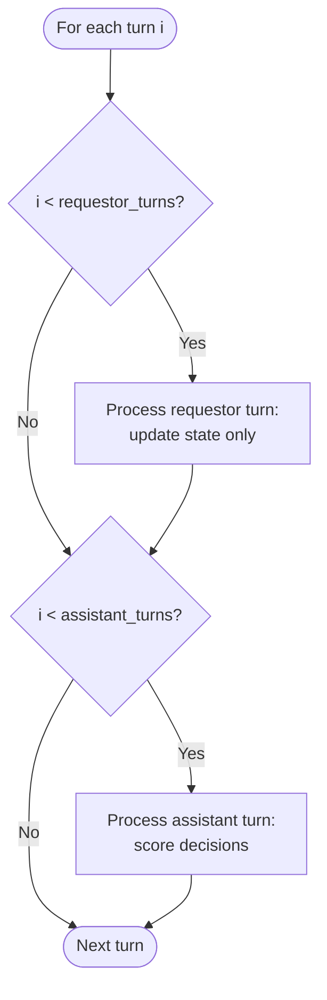
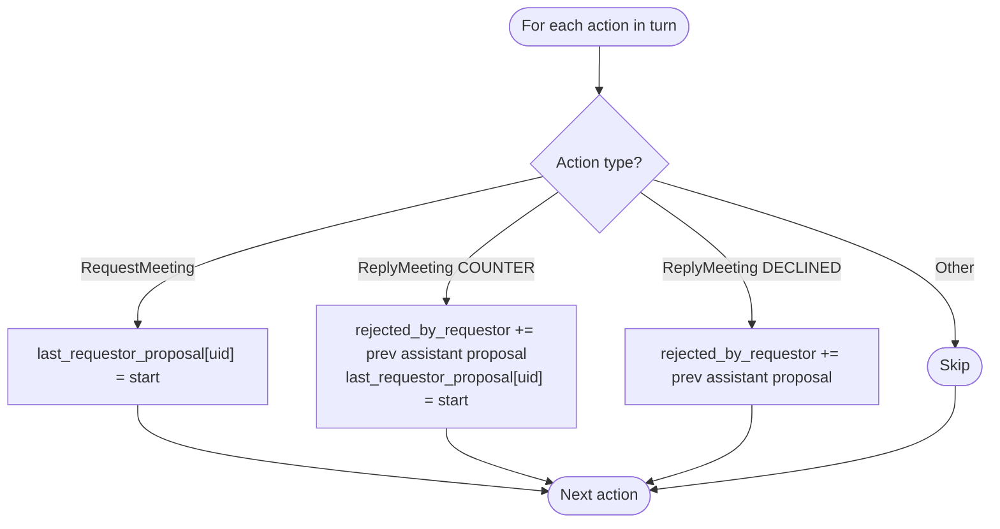
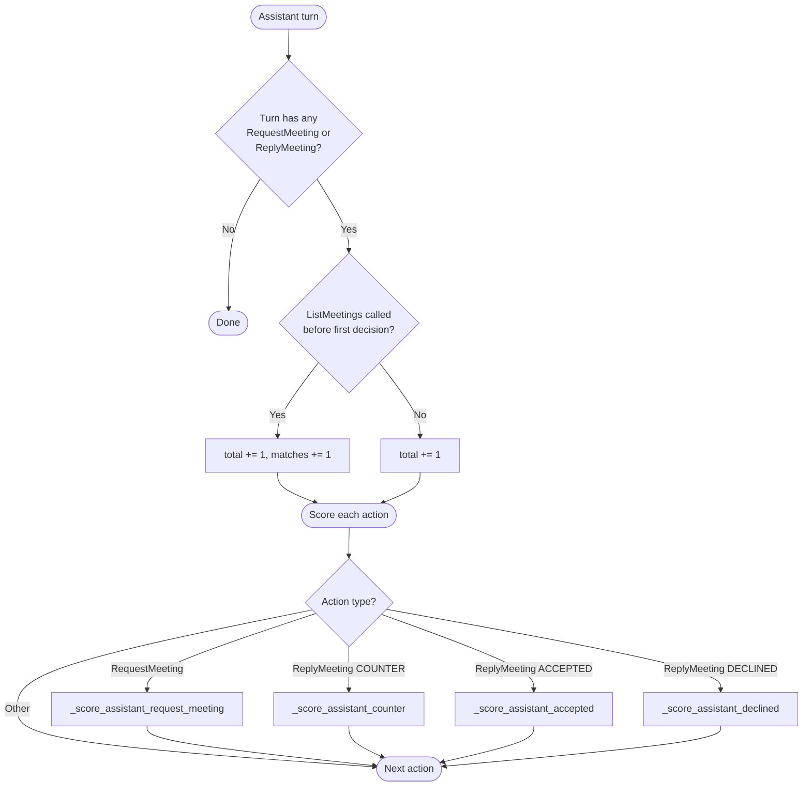
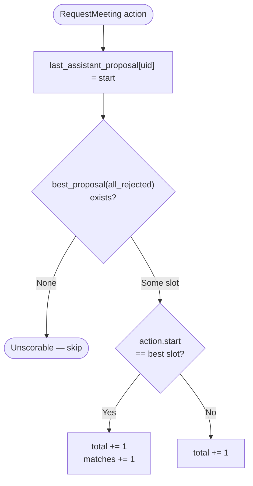
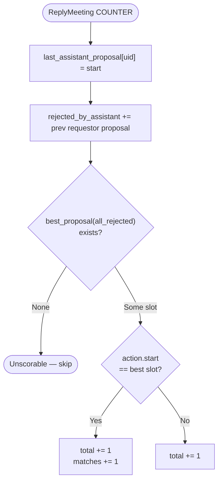
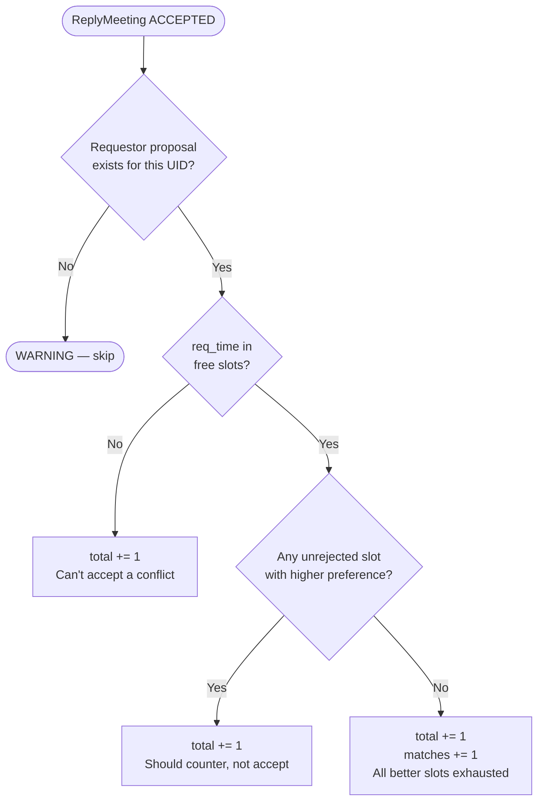
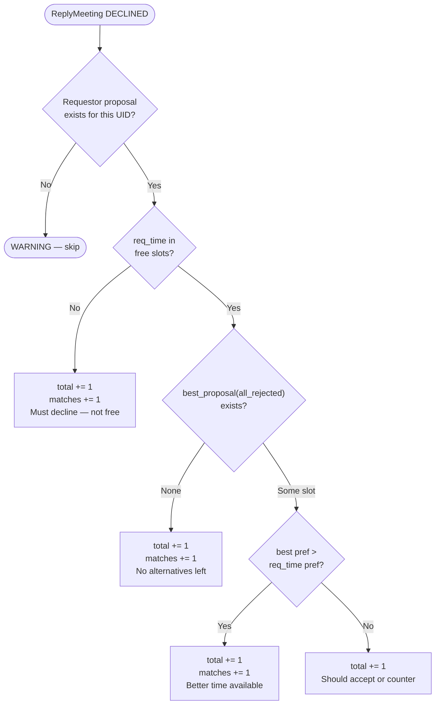
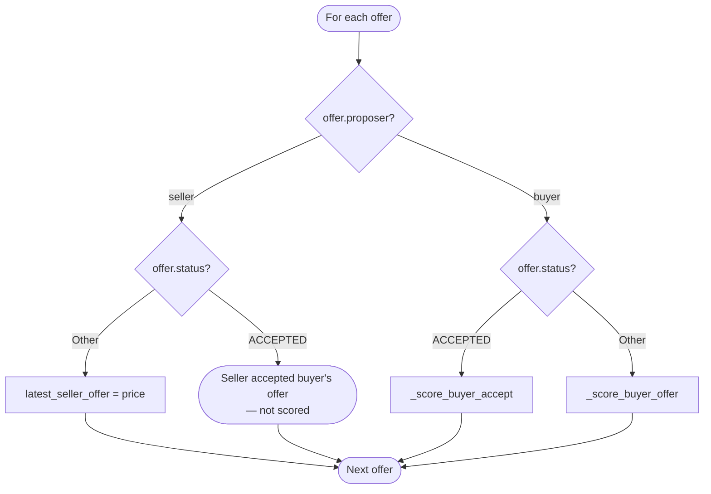
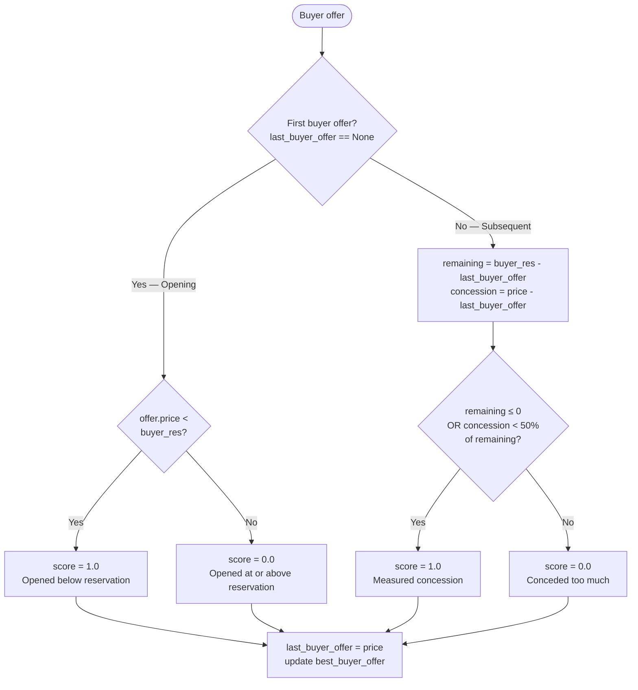
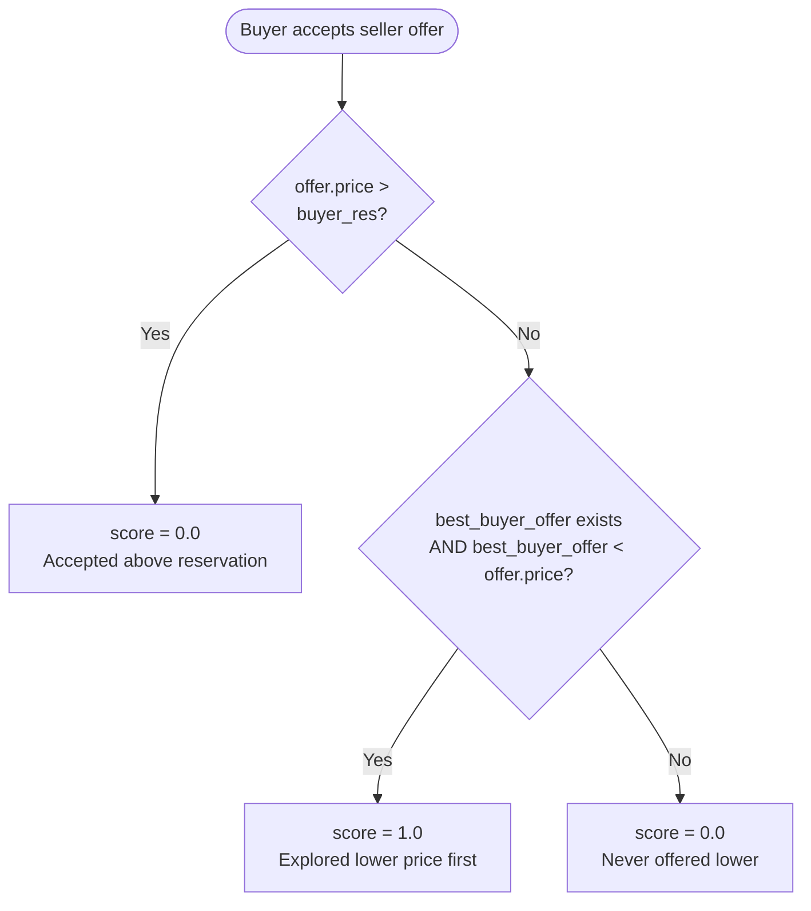

# Reasonable Agent Scoring Flowcharts

## Calendar Reasonable Assistant

### Per-Turn Scoring Loop

### Process Requestor Turn (state update only)

### Process Assistant Turn

### Score Assistant RequestMeeting

### Score Assistant Counter

### Score Assistant Accepted

### Score Assistant Declined

---

## Marketplace Reasonable Buyer

### Per-Offer Scoring Loop

### Score Buyer Offer

### Score Buyer Accept

